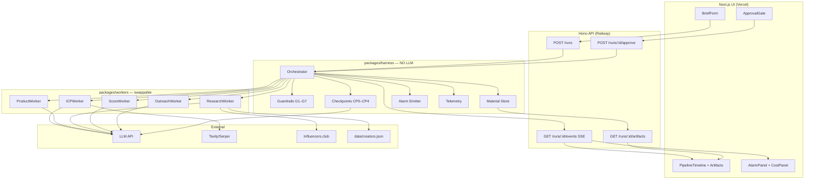

# Scout — Harness Planning Document

**Product:** [Scout](https://github.com/qianhe203/Scout) — an AI harness for creator discovery and evaluation  
**Domain:** Creator/influencer matching for B2B marketing  
**Architecture diagram:** `docs/diagrams/creator-match-harness-architecture.svg`  
**Hackathon guide:** [`docs/HACKATHON.md`](./HACKATHON.md) — demo script, defense prep, deliverables, 24h schedule  
**Last updated:** 2026-06-13

> **Build source of truth.** Product scope, requirements, schemas, and implementation details live here. Event-specific prep (demo, judging, deadlines) is in [`HACKATHON.md`](./HACKATHON.md).

---

## Table of contents

1. [Thesis](#thesis)
2. [What we're building](#what-were-building)
3. [Requirements (R1–R22)](#requirements-r1r22)
4. [ICPWorker — market research](#icpworker--market-research-strategy)
5. [Differentiation beyond Influencers.club](#differentiation--what-scout-adds-beyond-influencersclub)
6. [Technical architecture](#technical-architecture)
7. [Harness core](#harness-core-packagesharness)
8. [Workers](#workers-packagesworkers)
9. [Platform adapters & research](#platform-adapters--research-strategy)
10. [Schemas & artifacts](#schemas--artifacts)
11. [Observability](#observability-plan-pillar-4)
12. [Next.js UI](#nextjs-ui-appsweb)
13. [API layer](#api-layer-appsapi)
14. [Persistence & replay](#persistence--replay)
15. [Human-in-the-loop](#human-in-the-loop)
16. [Deployment](#deployment)
17. [Repo structure](#repo-structure)
18. [Implementation order](#implementation-order)
19. [Key tradeoffs](#key-tradeoffs)

---

## Thesis

> **Workers do tasks. The harness enforces constraints.**

**Scout** is a constraint framework that governs swappable worker agents finding creators for a client's product. Workers handle ICP discovery, research, scoring, and outreach drafting. The harness provides the runtime scaffolding — loop control, tool dispatch, guardrails, and observability — as **separate code** from workers.

The harness never calls an LLM for creative/domain work. Workers never enforce budget, professionalism, or platform rules. That separation is the core architectural boundary.

**Product boundary:** [Influencers.club](https://influencers.club/influencer-api/) supplies creator data. Scout applies client-specific constraints — budget, risk, professionalism, approval — before anything exports.

---

## What we're building

### Problem

Marketing teams waste hours researching creators, misjudging audience fit, and overpaying mega-influencers. Clients often arrive with incomplete inputs — product but no audience, budget but no risk tolerance — or with a *wrong* self-reported ICP that would send research down the wrong path.

### Solution

A multi-stage agent pipeline:

```
ClientBrief → [ICP research] → ProductBrief → Research → Score → Outreach → Human Approve → Export
              CP0              CP1           CP2       CP3      CP4
```

| Layer | Role |
|-------|------|
| **Next.js UI (Vercel)** | Brief form, live pipeline view, alarm feed, cost/telemetry panel, human approval gate — *not* the harness |
| **Harness API (`apps/api`)** | Hono server — runs orchestrator, exposes REST + SSE; *no UI logic* |
| **Harness (`packages/harness`)** | Orchestrator, guardrails, checkpoints, materials, alarms, telemetry — *no domain LLM logic* |
| **Workers (`packages/workers`)** | Swappable LLM-backed agents — *no budget/checkpoint enforcement* |

### Client inputs

| Field | Required | Notes |
|-------|----------|-------|
| Company name & description | Yes | Grounding; may include website URL |
| Product | Yes | What is being promoted |
| Budget | Yes | Hard guardrail on creator cost |
| Risk | Yes | `low` = scandal-averse; `high` = buzz-seeking, trending/edgy allowed |
| Target audience | No | **Hint only** — ICPWorker still runs independent research |
| Platform allow/block lists | No | Applied before API calls (G2/G3) |
| Company website URL | No | Optional pass-1 input; product page tried on evidence retry |
| Product page URL | No | Used on CP0 retry when evidence is thin |
| **Expanded brief fields** | No | See [Structured client inputs](#6-structured-client-inputs-expanded-brief) — one evidence source among ≥3 |
| IG credentials | No | Read-only brand voice only (G7) |

### Non-goals (MVP scope)

No auto-send (email/DM/post) · No payments/contracts · No production scandal ML · No full OAuth for every platform in MVP · No custom social scraping (Influencers.club replaces this) · No paid enterprise enrichment APIs (Clearbit, OpenFunnel, Selda) in MVP · No Postgres/Redis/Kubernetes

---

## Requirements (R1–R22)

### Harness — must

**Guardrails**

- **R1.** Guardrails exist as identifiable code modules separate from workers (`packages/harness/guardrails/`).
- **R2.** Declared guardrails include at minimum: budget cap, platform allow/block list, risk-tier rules, and outbound-action restrictions (no posts, no sends, no DMs without human approval).
- **R3.** When a guardrail blocks an action, the worker receives structured feedback and must revise or the run escalates.

**Checkpoints**

- **R4.** Checkpoints exist as identifiable code modules separate from workers (`packages/harness/checkpoints/`).
- **R5.** Each checkpoint has explicit pass/fail criteria (see [Checkpoints](#checkpoints-cp0cp4)).
- **R6.** Failed checkpoints block downstream stages; the harness retries or escalates — never silently continues.

**Material handling**

- **R7.** All inter-stage data passes through typed artifacts (`packages/harness/materials/`) — not ad-hoc strings.
- **R8.** Each artifact version is immutable once written; downstream stages read prior artifacts by type + latest version.

**Alarms**

- **R9.** Alarms exist as identifiable code modules separate from workers (`packages/harness/alarms/`).
- **R10.** Every alarm emits structured output: `{ type, context, severity, recommended_action, timestamp }`.

**Feedback loop**

- **R11.** Worker behavior must change based on guardrail/checkpoint feedback (e.g., ScoreWorker revises shortlist after G1; OutreachWorker revises after CP4 fail).

**Docs**

- **R12.** Runs accept real client input (company/product the operator provides).
- **R13.** `HARNESS.md` documents architecture, tradeoffs, and failure modes (see [`HACKATHON.md`](./HACKATHON.md) for judge-facing format).

### Harness — should

- **R14.** Workers implement a swappable interface — swapping research or outreach workers requires zero harness changes.
- **R15.** Checkpoint results persist to disk; a run can replay from any checkpoint without re-running prior stages.
- **R16.** Human-in-the-loop escalation when confidence is low, budget is ambiguous, or scandal/risk signals are detected.

### Domain behavior — workers

- **R17.** ICPWorker always runs independent market research before creator API spend using **≥3 evidence source types** (category web search, competitor inference, creator-graph signal, structured client brief, optional website/product page). Client-stated audience is a hint, not the ICP. Proposes 1–3 segments with evidence citations. On thin evidence, harness retries automatically (product page fetch, expanded web search) — **no human gate at CP0**.
- **R18.** ProductWorker enriches positioning, value props, and tone guidance from client inputs.
- **R19.** ResearchWorker discovers creators across configurable platforms, filtered by audience fit and risk tier.
- **R20.** ScoreWorker ranks creators on audience overlap, engagement quality, estimated cost, and platform fit.
- **R21.** OutreachWorker drafts personalized messages; it does not send them.
- **R22.** If IG credentials are provided, usage is read-only for voice matching — no posting, liking, or DMs.

---

## ICPWorker — market research strategy

### Principle: client input is a hint, not the ICP

Clients often misidentify their audience ("we want Gen Z" when buyers are actually millennial parents). Scout **always** runs independent market research before Influencers.club API spend. Client-stated audience is stored as `clientStatedAudience` and compared against researched segments — never copied blindly into `ICPProposal`.

**Evidence bar:** every `ICPProposal` must cite evidence from **≥3 distinct source types** (see [Evidence source types](#evidence-source-types)). At least **2 of those 3** must be non-client sources (`web_search_category`, `web_search_competitor`, `creator_graph`, `website`, or `product_page`). Structured client brief fields count as one source type (`client_brief`) but cannot satisfy CP0 alone.

**No human gate at CP0.** When evidence is thin, the harness fires `ICP_EVIDENCE_THIN`, runs an automated retry ladder (product page fetch, expanded web search), and re-evaluates CP0. Human approval remains at **export only** (see [Human-in-the-loop](#human-in-the-loop)).

If client audience and research diverge, `ICPProposal.clientAlignment` documents confirm / contradict / partial.

### Five ICP research strategies (MVP)

#### 1. Category / market research via web search

Primary independent signal. Search the **product category**, not just the company name.

| Query template | Purpose |
|----------------|---------|
| `"[product category]" buyer persona demographics` | Category-level ICP |
| `"[product category]" customer reviews who uses` | Buyer language from reviews |
| `"[product category]" influencer marketing audience` | Bridges ICP → creator channels |
| `"[company] [product]" target customer audience` | Company-specific corroboration |

**Adapter:** `webSearchAdapter` (Tavily/Serper) · **Evidence source:** `web_search_category`

#### 2. Competitor inference

Infer ICP from **who competitors market to** — positioning, pricing tier, case studies, review-site mentions.

| Query template | Purpose |
|----------------|---------|
| `"[product category]" alternatives OR competitors` | Map competitive set |
| `"[admiredCompetitor OR top competitor]" customers who uses reviews` | Borrow competitor audience signal |
| `"companies like [company]" target market` | Adjacent-player inference |

**Adapter:** `webSearchAdapter` (competitor query set) · **Evidence source:** `web_search_competitor`

#### 3. Creator-database reverse inference

Use Influencers.club (or seed) **before** full creator search: semantic lookup on product description → cluster **audience tags** of top-matching creators → infer ICP from "who already converts in this niche."

**Important:** supporting signal only — frames channels and personas, not proof of buyer demographics alone. Must appear alongside ≥2 other source types.

**Adapter:** `creatorGraphAdapter` (thin wrapper over influencers-club semantic search or seed filter) · **Evidence source:** `creator_graph`

#### 4. Structured client inputs (expanded brief)

Optional fields on `ClientBrief` — treated as **one evidence source type**, never the sole basis for ICP:

| Field | Example | Use |
|-------|---------|-----|
| `exampleCustomers` | `"Sarah, 34, suburban mom who meal-preps"` | Persona seed |
| `admiredCompetitor` | `"HelloFresh"` | Feeds competitor inference queries |
| `tractionChannels` | `["tiktok", "instagram"]` | Channel prior for segments |
| `whyTheyBuy` | `"People buy when they're too busy to cook"` | Jobs-to-be-done hint |
| `targetAudience` | `"Gen Z fitness"` | Stored as `clientStatedAudience`; compared in `clientAlignment` |

**Evidence source:** `client_brief` · Cross-checked against independent sources in synthesis.

#### 5. Automated retry on thin evidence (alarm-driven, not human)

When CP0 fails or distinct source count < 3, harness fires **`ICP_EVIDENCE_THIN`** and runs retry passes **without human input**:

```
Pass 1 (default)
  ├── web_search_category (3–4 queries)
  ├── web_search_competitor (2–3 queries)
  ├── creatorGraphAdapter (semantic cluster)
  ├── client_brief fields (if provided)
  └── websiteAdapter (company URL, if provided)
        ↓
      CP0 evaluate
        ↓ fail or <3 source types
Pass 2 (retry — triggered by alarm)
  ├── websiteAdapter.fetch(productUrl)     ← if productUrl present and not yet fetched
  ├── websiteAdapter.fetch(companyUrl)       ← if pass 1 skipped website
  └── webSearchAdapter (alternate query set) ← broader category + review-site queries
        ↓
      CP0 evaluate
        ↓ still fail
Pass 3 (final retry)
  └── Expanded web search: Reddit/G2/review-site targeted queries
        ↓
      CP0 evaluate
        ↓ still fail after 3 passes
Continue with best-effort ICPProposal (all segments confidence: low)
  + alarm ICP_EVIDENCE_THIN (severity: high, action: logged — pipeline continues)
  + alignmentNotes documents evidence gap
```

**No `HUMAN_REQUIRED` at stage 0.** Export gate still requires human approval later.

**Optional website/product page:** not required for pass 1. Product page is a **retry lever**, not a prerequisite — aligns with clients who have no site or only a landing page at kickoff.

### ICPWorker pipeline

```
┌─────────────────────────────────────────────────────────────┐
│  INPUT: ClientBrief (+ expanded brief fields)                 │
└────────────────────────────┬────────────────────────────────┘
                             │
    ┌────────────────────────┼────────────────────────┐
    ▼                        ▼                        ▼
webSearchAdapter      webSearchAdapter         creatorGraphAdapter
(category queries)    (competitor queries)     (semantic cluster
                                               → audience tags)
    │                        │                        │
    └────────────┬───────────┴───────────┬────────────┘
                 ▼                       ▼
          client_brief            websiteAdapter (optional pass 1;
          (structured fields)      product page on retry pass 2)
                 └───────────┬───────────┘
                             ▼
              LLM synthesis → ICPProposal
              (1–3 segments + evidence[] ≥3 source types)
                             │
                             ▼
                        CP0 checkpoint
                             │
                   fail / thin evidence
                             ▼
                   ICP_EVIDENCE_THIN alarm
                             ▼
                   automated retry ladder (pass 2–3)
                             │
                   still thin → low-confidence continue
```

### Evidence source types

| Source type | Origin | Counts toward CP0 "3 sources"? |
|-------------|--------|--------------------------------|
| `web_search_category` | Category/market web search | Yes (independent) |
| `web_search_competitor` | Competitor inference search | Yes (independent) |
| `creator_graph` | Influencers.club / seed cluster | Yes (independent) |
| `client_brief` | Expanded brief + targetAudience | Yes (client — max 1 of 3 for independence rule) |
| `website` | Company website fetch | Yes (independent) |
| `product_page` | Product URL fetch (often retry pass) | Yes (independent) |

**CP0 pass criteria (updated):**

| Criterion | Rule |
|-----------|------|
| Segments | ≥1 segment with persona, channels, rationale |
| Source diversity | `evidence[]` spans **≥3 distinct source types** |
| Independence | ≥2 source types are **not** `client_brief` |
| Retry | Up to 3 automated passes before low-confidence continue |
| Human | **None** at CP0 |

### Research tools (MVP)

| Tool | Adapter | Purpose | When |
|------|---------|---------|------|
| **Category web search** | `webSearchAdapter` | Market/buyer persona signals | Pass 1 always |
| **Competitor web search** | `webSearchAdapter` | Competitor audience inference | Pass 1 always |
| **Creator graph** | `creatorGraphAdapter` | Reverse-infer from creator audience tags | Pass 1 always |
| **Structured client brief** | *(input)* | Hypothesis + alignment check | Pass 1 if fields provided |
| **Company website** | `websiteAdapter` | Positioning, pricing cues | Pass 1 if URL provided; else skip |
| **Product page** | `websiteAdapter` | Product-specific copy | **Retry pass 2** if `productUrl` set |

**Deferred:** Selda, EnrichAPI, OpenFunnel, Clearbit — production-grade enrichment; out of MVP scope.

### Web search query templates (pass 1)

**Category set:**
1. `"[product category]" buyer persona demographics`
2. `"[product category]" customer reviews who uses`
3. `"[product category]" influencer marketing creators audience`
4. `"[company] [product]" target customer audience`

**Competitor set:**
5. `"[product category]" alternatives competitors`
6. `"[admiredCompetitor]" customers reviews OR target audience` *(if `admiredCompetitor` in brief)*
7. If `clientStatedAudience` set: `"[product category]" "[stated audience]" fit OR mismatch`

**Retry pass 2–3 (alternate / broader):**
8. `"[product category]" site:reddit.com OR site:g2.com reviews`
9. `"[product]" "who is this for" OR "ideal customer"`
10. `"[competitor from pass 1 result]" marketing audience`

ResearchWorker reuses `ICPProposal` — it does **not** re-run ICP research.

### ICPWorker vs ProductWorker boundary

| Worker | Question it answers | Runs when |
|--------|---------------------|-----------|
| **ICPWorker** | *Who* should we reach? | Stage 0 — always |
| **ProductWorker** | *What* are we selling and *how* should we talk about it? | Stage 1 — after CP0 |

Shared `websiteAdapter` code; different prompts and output artifacts. ProductWorker focuses on tone/value prop — not audience discovery.

---

## Differentiation — what Scout adds beyond Influencers.club

Influencers.club is the **data pipe**. Scout adds **constraint orchestration** and **client-specific reasoning** the API does not provide.

### Harness capabilities (constraint layer)

| Module | Behavior |
|--------|----------|
| **G1 Budget** | Shortlist total > budget → ScoreWorker revises under cap |
| **G2/G3 Platform** | Allow/block applied before ResearchWorker API calls |
| **G4/G5 Risk** | Same raw data, different shortlist weights for `risk=low` vs `high` |
| **CP0–CP4** | Explicit pass/fail between stages; CP4 evaluator separate from OutreachWorker |
| **Human gate** | Export blocked until approval; G6 blocks all outbound sends |
| **Alarms + replay** | Structured events persisted; replay from any checkpoint |
| **Telemetry** | Per-stage token/cost; spin detection |

### Worker capabilities (domain layer)

| Worker | Logic beyond raw API results |
|--------|---------------------------|
| **ICPWorker** | Multi-source research (≥3 evidence types); automated CP0 retry |
| **ProductWorker** | Value props + tone for downstream scoring and outreach |
| **ResearchWorker** | Query translator — ICP + ProductBrief → Influencers.club filters |
| **ScoreWorker** | Client-specific fit rubric, micro-vs-macro thesis, per-creator `rationale` |
| **OutreachWorker** | Brand-voice drafts; professionalism checked by harness CP4, not inline |

**ScoreWorker rubric** (weights shift by `risk`):

```
fitScore = w1·audienceOverlap + w2·engagementQuality + w3·costEfficiency
         + w4·platformFit + w5·brandSafety
```

**G1 budget revision:** ScoreWorker re-optimizes under cap (knapsack on fitScore) → `RankedShortlist_v2` — do **not** re-call the API.

---

## Technical architecture

### Stack

| Piece | Choice | Why |
|-------|--------|-----|
| Language | **TypeScript** (Node 20+) | Shared types across harness, workers, API, UI |
| Monorepo | **pnpm workspaces** | `apps/web`, `apps/api`, `packages/*` |
| UI | **Next.js 15** (App Router) | Deploy to **Vercel** |
| API | **Hono** on Node | SSE + persistent disk; deploy to **Railway** |
| ICP research | **Tavily/Serper + creator graph + optional website/product page** | ≥3 source types; automated retry on thin evidence |
| Creator data | **[Influencers.club API](https://docs.influencers.club/)** | Discovery + enrichment; 10 free trial credits |
| Creator fallback | **`data/creators.json`** | Fallback reliability; `RESEARCH_SOURCE_DOWN` alarm |
| LLM | **Claude or GPT** via unified wrapper | Workers + CP4 evaluator; token metering |
| Telemetry | **OpenTelemetry** + harness run log | [Fired Festival OTel guidance](https://fired-festival.com/harness) |
| Validation | **Zod** | All artifacts at write time |
| Persistence | **JSON files** in `runs/{id}/` | On Railway API disk |

### Layer diagram

```
┌─────────────────────────────────────────────────────────────┐
│  Next.js UI (Vercel) — Brief · Pipeline · Alarms · Cost     │
└────────────────────────────┬────────────────────────────────┘
                             │ POST /runs · GET /runs/:id/events (SSE)
┌────────────────────────────▼────────────────────────────────┐
│  Hono API (Railway) — apps/api                               │
└────────────────────────────┬────────────────────────────────┘
                             │
┌────────────────────────────▼────────────────────────────────┐
│  SCOUT HARNESS (packages/harness)                            │
│  Orchestrator │ Guardrails │ Checkpoints │ Materials │ Alarms│
│  Telemetry (OTel + run-log writers)                          │
└────────────────────────────┬────────────────────────────────┘
                             │
┌────────────────────────────▼────────────────────────────────┐
│  WORKERS (packages/workers)                                  │
│  ICP · Product · Research · Score · Outreach                 │
│  └── adapters: website · web-search · influencers-club · seed  │
└─────────────────────────────────────────────────────────────┘
```

### End-to-end flow (mermaid)



### Pipeline stages

| Stage | Worker | Output artifact | Checkpoint after |
|-------|--------|-----------------|------------------|
| 0 | ICPWorker | `ICPProposal` | CP0: ≥3 evidence source types + segment clarity |
| 1 | ProductWorker | `ProductBrief` | CP1: positioning complete |
| 2 | ResearchWorker | `CreatorCandidates` | CP2: min candidates |
| 3 | ScoreWorker | `RankedShortlist` | CP3: scores pass threshold |
| 4 | OutreachWorker | `OutreachDrafts` | CP4: professionalism pass |
| 5 | *(harness)* | `CampaignPack` | Human approval gate |

### Architecture decisions

| Decision | Chosen | Rejected alternative | Why |
|----------|--------|---------------------|-----|
| Research scope | Platform adapters + allow/block + risk tier | Wide open web trawl | Controllable, bounded scope, maps to client inputs |
| Professionalism | CP4 checkpoint module (separate LLM evaluator) | Prompt-only in OutreachWorker | Checkpoints must be distinct from workers |
| IG access | Optional read-only voice analysis | Full IG integration | Scope creep, violates G6 |
| ICP timing | Always run ICPWorker with multi-source research | Skip when client provides audience | Client self-report is often wrong |
| ICP thin evidence | Automated retry (product page + expanded search) + continue low-confidence | Human gate at CP0 | Harness self-heals at stage 0 |
| ICP evidence bar | ≥3 distinct source types | Single website fetch | Independent corroboration |
| UI vs harness | Next.js on Vercel, harness on Railway | Monolith on Vercel | Vercel has no persistent disk for `runs/` |
| SSE vs WebSocket | SSE via Hono API | WebSocket | One-way push; simpler for this use case |

---

## Harness core (`packages/harness`)

This is the product. Workers are plugins; the harness is the constraint framework.

### Orchestrator

Central state machine. Pseudocode for one stage:

```typescript
async function runStage(stage: Stage, ctx: HarnessContext): Promise<void> {
  const stageSpan = telemetry.startStage(stage, ctx.runId);
  emitSSE(ctx.runId, { kind: "stage_started", stage });

  // 1. Pre-stage guardrails (e.g. G2/G3 before ResearchWorker)
  const pre = await guardrails.enforcePre(stage, ctx);
  if (pre.blocked) {
    await alarms.emit(pre.alarm);
    emitSSE(ctx.runId, { kind: "guardrail", id: pre.id, blocked: true, feedback: pre.feedback });
    ctx.feedback = pre.feedback;
    return retryOrEscalate(stage, ctx);
  }

  // 2. Run worker (with token budget check)
  if (telemetry.exceedsTokenBudget(ctx.runId)) {
    await alarms.emit({ type: "TOKEN_BUDGET_WARNING", severity: "medium", ... });
    return pauseForHuman(ctx);
  }
  const worker = registry.getWorker(stage);
  const artifact = await worker.run(ctx);

  // 3. Validate + persist artifact (immutable, versioned)
  const validated = materials.validateAndStore(stage, artifact, ctx.runId);
  ctx.artifacts[validated.type] = validated;
  emitSSE(ctx.runId, { kind: "artifact_written", artifactType: validated.type, version: validated.version });

  // 4. Post-stage checkpoint
  const cp = await checkpoints.evaluate(stage, ctx);
  await materials.writeCheckpoint(ctx.runId, cp);
  emitSSE(ctx.runId, { kind: "checkpoint", id: cp.id, passed: cp.passed, details: cp.details });
  if (!cp.passed) {
    await alarms.emit(cp.alarm);
    ctx.feedback = cp.feedback;
    return retryOrEscalate(stage, ctx);
  }

  // 5. Post-stage guardrails (e.g. G1 budget after scoring)
  const post = await guardrails.enforcePost(stage, ctx);
  if (post.blocked) {
    await alarms.emit(post.alarm);
    emitSSE(ctx.runId, { kind: "guardrail", id: post.id, blocked: true, feedback: post.feedback });
    ctx.feedback = post.feedback;
    return retryOrEscalate(stage, ctx);
  }

  telemetry.endStage(stageSpan);
  emitSSE(ctx.runId, { kind: "stage_completed", stage, durationMs: stageSpan.durationMs });
  await advanceToNextStage(ctx);
}
```

**Retry policy:** Each stage allows 1–2 retries with structured feedback in `HarnessContext.feedback`. After max retries → alarm + `HUMAN_REQUIRED` + pause.

**Watchdog:** If stage duration > 120s → alarm `LLM_SPIN_DETECTED` + pause.

### Guardrails (G1–G7)

Pure functions in `packages/harness/guardrails/`. No LLM.

| ID | Rule | Enforcement point |
|----|------|-------------------|
| G1 | Total estimated creator cost ≤ budget | After scoring; blocks CP3 pass |
| G2 | Research platforms ⊆ allowlist (if set) | Before ResearchWorker |
| G3 | Research platforms ∩ blocklist = ∅ | Before ResearchWorker |
| G4 | Risk=low → exclude scandal flags (24mo) | During scoring |
| G5 | Risk=high → boost trending signals | During scoring; reweights only |
| G6 | No outbound actions — draft only | Global hard block |
| G7 | IG credentials: read-only scope | Before any IG tool call |

**G1 example:**

```typescript
// packages/harness/guardrails/g1-budget.ts
function enforceBudget(ctx: HarnessContext): GuardrailResult {
  const shortlist = ctx.artifacts.RankedShortlist;
  const total = shortlist.creators.reduce((s, c) => s + c.estimatedCost, 0);
  if (total > ctx.clientBrief.budget) {
    return {
      blocked: true,
      alarm: {
        type: "BUDGET_EXCEEDED",
        severity: "high",
        context: { budget: ctx.clientBrief.budget, currentTotal: total },
        recommended_action: "Reduce shortlist or raise budget with human approval",
      },
      feedback: {
        kind: "budget_exceeded",
        trimToBudget: ctx.clientBrief.budget,
        currentTotal: total,
        creatorsToRemove: shortlist.creators
          .sort((a, b) => a.fitScore - b.fitScore)
          .slice(0, shortlist.creators.length - 5)
          .map(c => c.id),
      },
    };
  }
  return { blocked: false };
}
```

### Checkpoints (CP0–CP4)

| ID | Evaluator | Pass criteria | Fail action |
|----|-----------|---------------|-------------|
| CP0 | Deterministic (Zod + evidence rule) | ≥1 segment with persona, channels, rationale; **≥3 distinct evidence source types**; ≥2 non-`client_brief` | Automated retry ladder (product page + expanded search) → `ICP_EVIDENCE_THIN`; low-confidence continue if still thin — **no human** |
| CP1 | Deterministic | Product value prop, differentiators, tone present | Retry ProductWorker → `PRODUCT_UNCLEAR` |
| CP2 | Deterministic | ≥5 candidates across ≥2 platforms (≥3 if single-platform allowlist) | Retry ResearchWorker → `INSUFFICIENT_CANDIDATES` |
| CP3 | Deterministic | Top 5 each score ≥60/100 | Re-score → `LOW_FIT_SCORES` |
| CP4 | **LLM evaluator** (harness module, not OutreachWorker) | Professionalism rubric ≥80/100 | OutreachWorker revises → `PROFESSIONALISM_FAIL` after 2 retries |

**CP4 evaluator checks:** no false guarantees, no spam tone, brand alignment, appropriate CTA, grammar. Returns `{ score, failures[] }`.

**CP4 → OutreachWorker feedback payload:**

```typescript
interface ProfessionalismFeedback {
  kind: "professionalism_fail";
  score: number;
  failures: string[];       // e.g. "Contains guarantee language", "CTA too aggressive"
  draftsToRevise: string[]; // creator IDs
}
```

### Alarms

```typescript
interface Alarm {
  type: string;
  context: Record<string, unknown>;
  severity: "low" | "medium" | "high";
  recommended_action: string;
  timestamp: string;
}
```

| Type | Severity | Trigger |
|------|----------|---------|
| `BUDGET_EXCEEDED` | high | G1 violation |
| `PLATFORM_BLOCKED` | medium | G2/G3 violation |
| `ICP_EVIDENCE_THIN` | high | CP0 fail or <3 source types — triggers automated retry (product page, expanded web search) |
| `ICP_LOW_CONFIDENCE` | medium | All retry passes exhausted; pipeline continues with low-confidence segments |
| `INSUFFICIENT_CANDIDATES` | medium | CP2 fail |
| `SCANDAL_DETECTED` | high | G4 on low-risk client |
| `PROFESSIONALISM_FAIL` | medium | CP4 fail after retries |
| `RESEARCH_SOURCE_DOWN` | medium | API/search failure → seed fallback |
| `LLM_SPIN_DETECTED` | high | Stage exceeds time/token threshold |
| `TOKEN_BUDGET_WARNING` | medium | Run approaching per-run token cap |
| `HUMAN_REQUIRED` | high | Escalation or approval needed |

Alarms append to `runs/{runId}/alarms.jsonl` and emit on SSE.

### Material handling

- Zod schemas for every artifact in `packages/shared/schemas/`.
- On write: validate → assign `{ id, version, createdAt, runId }` → write to `runs/{runId}/artifacts/{type}_v{n}.json`.
- Artifacts are **immutable**; revisions create new versions.
- Downstream stages read by type + latest version only.

```
ClientBrief → ICPProposal → ProductBrief → CreatorCandidates → RankedShortlist → OutreachDrafts → CampaignPack
```

---

## Workers (`packages/workers`)

### Worker interface

```typescript
interface Worker {
  name: string;
  run(ctx: HarnessContext): Promise<Artifact>;
}

interface HarnessContext {
  runId: string;
  clientBrief: ClientBrief;
  artifacts: Record<string, Artifact>;
  feedback?: GuardrailFeedback | CheckpointFeedback;
  config: HarnessConfig;
  telemetry: TelemetryContext;
}
```

Workers **may** call LLMs and tools via `llm.ts` wrapper. They **must not** enforce guardrails or decide checkpoint pass/fail.

### Worker implementations

| Worker | LLM role | Tools / data |
|--------|----------|--------------|
| **ICPWorker** | Synthesize 1–3 segments with ≥3 source types | `webSearchAdapter` (category + competitor) + `creatorGraphAdapter` + optional `websiteAdapter` |
| **ProductWorker** | Enrich value props, differentiators, tone | Optional: `websiteAdapter` |
| **ResearchWorker** | Translate ICP → API query; synthesize candidates | `influencersClubAdapter`, `seedAdapter`, optional `webAdapter` |
| **ScoreWorker** | Apply rubric; output ranked list with rationales | Reads `CreatorCandidates` + `ProductBrief` + `ICPProposal` |
| **OutreachWorker** | Draft personalized messages per creator | Reads `RankedShortlist`; optional IG voice summary |

Use **structured output** (JSON mode / tool use). On parse failure, worker retries once internally before throwing to harness.

### LLM call budget (typical run)

| Call | Owner | When |
|------|-------|------|
| ICP synthesis | ICPWorker | Stage 0 — always |
| Product enrichment | ProductWorker | Stage 1 |
| Research synthesis | ResearchWorker | Stage 2 (after adapters return) |
| Scoring reasoning | ScoreWorker | Stage 3 (may repeat on G1) |
| Outreach drafts | OutreachWorker | Stage 4 (may repeat on CP4) |
| Professionalism eval | CP4 checkpoint | After stage 4 |

~5–8 LLM calls per run. CP0–CP3 are deterministic (no LLM). Target latency: ~30–90 seconds with streaming UI.

### Swapping workers

```typescript
// apps/api/src/worker-registry.ts
export function createWorkers(mode: "llm" | "seed-only" = "llm") {
  return {
    icp: new IcpWorker(),
    product: new ProductWorker(),
    research: mode === "seed-only" ? new SeedResearchWorker() : new LlmResearchWorker(),
    score: new ScoreWorker(),
    outreach: new OutreachWorker(),
  };
}
```

Harness code unchanged — only registry binding changes. Pass `?workerMode=seed-only` on `POST /runs` for fallback testing without live API.

---

## Platform adapters & research strategy

### ICPWorker adapters

```
webSearchAdapter.search(categoryQueries[]) → { results: [{ url, snippet, title }] }
webSearchAdapter.search(competitorQueries[]) → { results: [...] }
creatorGraphAdapter.infer(query from ClientBrief) → { audienceTags[], topCreatorHandles[], rationale }
websiteAdapter.fetch(url) → { title, aboutText, productText, pricingCues }
```

**Pass 1:** category search + competitor search + creator graph (+ website if URL provided).  
**Pass 2+ (retry):** product page fetch, company website if skipped, alternate/broader query set.

### ResearchWorker adapters

```typescript
interface ResearchAdapter {
  name: string;
  discover(query: ResearchQuery, ctx: HarnessContext): Promise<CreatorCandidate[]>;
}

interface ResearchQuery {
  icp: ICPProposal;
  product: ProductBrief;
  platforms: string[];       // after G2/G3 filtering
  maxResults: number;
}
```

**Influencers.club adapter** (`adapters/influencers-club.ts`):

- Translate `ICPProposal.recommendedPrimarySegment` + `ProductBrief` → API filters / semantic search params
- Normalize response → `CreatorCandidate[]`
- Enrich top N handles (1 credit each) if credits allow
- On failure → throw → harness catches → `seedAdapter` fallback + `RESEARCH_SOURCE_DOWN` alarm

**Seed adapter** (`adapters/seed.ts`):

- Filter `data/creators.json` by platform + audience tags matching ICP segments
- Always available for fallback reliability

### Adapter fallback behavior

| Adapter | Primary behavior | Fallback |
|---------|------------------|----------|
| **Influencers.club** | Discovery + enrichment | → seed + `RESEARCH_SOURCE_DOWN` alarm |
| **Web search** | ICP research | Return [] → lower ICP confidence; triggers retry ladder |
| **Instagram, TikTok, X, …** | Via Influencers.club or seed filter | Seeded file (no OAuth in MVP) |
| **Risk filter** | Applied in harness G4/G5 during scoring | — |

### Seed file shape (`data/creators.json`)

```json
{
  "id": "creator_001",
  "handle": "@example",
  "platform": "tiktok",
  "audienceTags": ["fitness", "millennials", "home-workout"],
  "estimatedRate": 800,
  "engagementRate": 0.042,
  "followerCount": 45000,
  "scandalFlag": false,
  "trendingScore": 0.7
}
```

Seed 20–30 creators across ≥3 platforms for reliable CP2 pass when using seed adapter.

---

## Schemas & artifacts

All schemas in `packages/shared/schemas/`. Validate at write time with Zod.

### ClientBrief (harness input)

```typescript
interface ClientBrief {
  company: string;
  companyDescription: string;
  companyWebsiteUrl?: string;
  product: string;
  productUrl?: string;              // fetched on CP0 retry if evidence thin
  budget: number;
  risk: "low" | "high";
  targetAudience?: string;        // hint — stored as clientStatedAudience in ICPProposal
  // Expanded brief (structured client inputs — one evidence source type)
  exampleCustomers?: string[];    // e.g. ["Sarah, 34, suburban mom who meal-preps"]
  admiredCompetitor?: string;     // feeds competitor inference queries
  tractionChannels?: string[];    // e.g. ["tiktok", "instagram"]
  whyTheyBuy?: string;            // jobs-to-be-done hint
  platformAllowlist?: string[];
  platformBlocklist?: string[];
  igCredentials?: { token: string };  // read-only; G7 enforced
}
```

### ICPProposal

```typescript
interface ICPProposal {
  segments: Array<{
    persona: string;
    demographics: string;
    channels: string[];
    rationale: string;
    confidence: "high" | "medium" | "low";
    evidence: Array<{
      source:
        | "web_search_category"
        | "web_search_competitor"
        | "creator_graph"
        | "client_brief"
        | "website"
        | "product_page";
      url?: string;
      snippet: string;
    }>;
  }>;
  clientStatedAudience?: string;
  clientAlignment: "confirmed" | "contradicted" | "partial" | "no_client_input";
  alignmentNotes?: string;
  recommendedPrimarySegment: number;
  evidenceSourceTypes: string[];  // distinct types present — must be ≥3 for CP0 pass
  icpRetryPasses: number;         // how many retry passes ran (0–3)
}
```

### ProductBrief

```typescript
interface ProductBrief {
  valueProposition: string;
  differentiators: string[];
  toneGuidance: string;         // e.g. "professional but approachable"
  keyMessages: string[];
  avoidPhrases?: string[];
}
```

### CreatorCandidate

```typescript
interface CreatorCandidate {
  id: string;
  handle: string;
  platform: string;
  followerCount: number;
  engagementRate: number;
  estimatedRate: number;
  audienceTags: string[];
  scandalFlag: boolean;
  trendingScore: number;
  source: "influencers_club" | "seed" | "web";
}
```

### RankedShortlist

```typescript
interface RankedShortlist {
  summary: string;              // portfolio thesis: micro vs macro, total cost
  creators: Array<{
    id: string;
    handle: string;
    platform: string;
    fitScore: number;
    rationale: string;          // why this creator for this client
    estimatedCost: number;
    audienceOverlap: number;
  }>;
  totalEstimatedCost: number;
}
```

### OutreachDrafts

```typescript
interface OutreachDrafts {
  drafts: Array<{
    creatorId: string;
    subject?: string;
    body: string;
    tone: string;
  }>;
}
```

### CampaignPack (final export)

```typescript
interface CampaignPack {
  shortlist: RankedShortlist;
  outreach: OutreachDrafts;
  icp: ICPProposal;
  runLogSummary: string;
  exportedAt: string;
}
```

Written to `runs/{runId}/export/campaign-pack.csv` + `summary.md` after human approval.

### RunEvent (SSE)

```typescript
type RunEvent =
  | { kind: "stage_started"; stage: string }
  | { kind: "stage_completed"; stage: string; durationMs: number }
  | { kind: "artifact_written"; artifactType: string; version: number; path: string }
  | { kind: "checkpoint"; id: string; passed: boolean; details: unknown }
  | { kind: "guardrail"; id: string; blocked: boolean; feedback: unknown }
  | { kind: "alarm"; alarm: Alarm }
  | { kind: "llm_call"; worker: string; model: string; inputTokens: number; outputTokens: number; estimatedCostUsd: number; latencyMs: number }
  | { kind: "tool_call"; adapter: string; success: boolean; latencyMs: number }
  | { kind: "human_required"; reason: string }
  | { kind: "run_complete"; exportPath: string; totalCostUsd: number; totalTokens: number };
```

---

## Observability plan (Pillar 4)

Every stage, checkpoint, guardrail hit, LLM call, tool call, alarm, token, and cost estimate must be:

1. **Durable** — written to `runs/{id}/`
2. **Live** — streamed via SSE
3. **Traceable** — exported as OTel spans

### Layer 1 — Run artifacts

| Path | Contents |
|------|----------|
| `runs/{id}/meta.json` | Run status, stage, brief snapshot, timestamps |
| `runs/{id}/artifacts/{type}_v{n}.json` | Immutable stage outputs |
| `runs/{id}/checkpoints/CP{n}.json` | `{ passed, at, criteria, details }` |
| `runs/{id}/alarms.jsonl` | One JSON alarm per line |
| `runs/{id}/run-log.json` | Aggregate `HarnessRunLog` |
| `runs/{id}/telemetry.jsonl` | Per-call token/cost/latency (append-only) |
| `runs/{id}/export/` | `campaign-pack.csv`, `summary.md` |

### Layer 2 — SSE events

See [Layer 1 — Run artifacts](#layer-1--run-artifacts) above. API uses in-memory pub/sub keyed by `runId` (single server instance).

### Layer 3 — UI components

| Component | Shows |
|-----------|-------|
| **PipelineTimeline** | Stage badges pass/fail/retry + `durationMs` |
| **ArtifactViewer** | Typed JSON + version diff (v1 → v2 after G1) |
| **AlarmPanel** | Raw alarm JSON |
| **CostPanel** | Per-stage token in/out, estimated `$`, model name |
| **RunLogPanel** | Collapsed `HarnessRunLog` summary |
| **FeedbackBanner** | Worker revision in progress after guardrail/checkpoint fail |

### Layer 4 — Harness-native telemetry

`packages/workers/llm.ts` — **all LLM calls go through this wrapper:**

```typescript
async function callLLM(opts: LLMCallOptions): Promise<LLMResult> {
  const span = tracer.startSpan(`worker.${opts.worker}.${opts.purpose}`, {
    attributes: {
      "harness.run_id": opts.runId,
      "harness.stage": opts.stage,
      "gen_ai.request.model": opts.model,
      "gen_ai.operation.name": opts.purpose,
    },
  });
  const start = Date.now();
  const result = await provider.complete(opts);

  const usage = {
    inputTokens: result.usage.input_tokens,
    outputTokens: result.usage.output_tokens,
    estimatedCostUsd: estimateCost(opts.model, result.usage),
    latencyMs: Date.now() - start,
  };

  span.setAttributes({
    "gen_ai.usage.input_tokens": usage.inputTokens,
    "gen_ai.usage.output_tokens": usage.outputTokens,
    "gen_ai.usage.total_tokens": usage.inputTokens + usage.outputTokens,
    "scout.cost.estimated_usd": usage.estimatedCostUsd,
  });
  span.end();

  await telemetryWriter.append(opts.runId, { kind: "llm_call", ...usage });
  await emitSSE(opts.runId, { kind: "llm_call", worker: opts.worker, model: opts.model, ...usage });
  return result;
}
```

**Model cost table** (`packages/shared/model-pricing.ts`):

```typescript
const MODEL_PRICING: Record<string, { inputPer1M: number; outputPer1M: number }> = {
  "claude-sonnet-4-20250514": { inputPer1M: 3, outputPer1M: 15 },
  "gpt-4o": { inputPer1M: 2.5, outputPer1M: 10 },
  "gpt-4o-mini": { inputPer1M: 0.15, outputPer1M: 0.6 },
};
```

**Spin / runaway detection:**

| Signal | Threshold | Action |
|--------|-----------|--------|
| Stage duration | > 120s | Alarm `LLM_SPIN_DETECTED`; pause stage |
| LLM parse retries in one stage | > 2 | Alarm + escalate |
| Per-run total tokens | > `RUN_TOKEN_BUDGET` (default 50k) | Alarm `TOKEN_BUDGET_WARNING`; block new LLM calls |
| Per-run estimated cost | > `RUN_COST_CAP` (default $2) | Alarm + `HUMAN_REQUIRED` |

### Layer 5 — OpenTelemetry export (MVP)

Use [GenAI semantic conventions](https://opentelemetry.io/docs/specs/semconv/gen-ai/) (`gen_ai.*` attributes).

**Packages:** `@opentelemetry/api`, `@opentelemetry/sdk-node`, `@opentelemetry/exporter-trace-otlp-http`

**Span hierarchy:**

```
harness.run { run_id, client, budget }
├── harness.stage.icp
│   ├── adapter.website.fetch
│   ├── adapter.web_search.query × N
│   └── worker.llm.icp_synthesis
├── harness.stage.product
├── harness.stage.research
│   ├── adapter.influencers_club.discover
│   └── worker.llm.research_synthesis
├── harness.stage.score
│   ├── guardrail.g1.budget → retry
│   └── worker.llm.score
├── harness.stage.outreach
│   └── checkpoint.cp4.evaluate
└── harness.export
```

**Bootstrap** (`apps/api/src/instrumentation.ts`) — import **before** other modules:

```typescript
import { NodeSDK } from "@opentelemetry/sdk-node";
import { OTLPTraceExporter } from "@opentelemetry/exporter-trace-otlp-http";
import { Resource } from "@opentelemetry/resources";

const sdk = new NodeSDK({
  resource: new Resource({ "service.name": "scout-api" }),
  traceExporter: process.env.OTEL_EXPORTER_OTLP_ENDPOINT
    ? new OTLPTraceExporter()
    : undefined,
});
sdk.start();
```

| Environment | Exporter |
|-------------|----------|
| Local dev | Console + `telemetry.jsonl` |
| Railway prod | OTLP → Jaeger or Honeycomb free tier |

### HarnessRunLog shape

```typescript
interface StageTelemetry {
  stage: string;
  durationMs: number;
  llmCalls: number;
  inputTokens: number;
  outputTokens: number;
  estimatedCostUsd: number;
  toolCalls: Array<{ adapter: string; latencyMs: number; success: boolean }>;
  checkpoint?: { id: string; passed: boolean };
  guardrailHits?: string[];
}

interface HarnessRunLog {
  runId: string;
  stages: StageTelemetry[];
  totalInputTokens: number;
  totalOutputTokens: number;
  totalEstimatedCostUsd: number;
  alarms: Alarm[];
  otelTraceId?: string;
}
```

### Evals and debugging

| Use case | How |
|----------|-----|
| Debug failed run | `run-log.json` + OTel trace + artifact versions |
| Cost post-mortem | `telemetry.jsonl` + CostPanel |
| Checkpoint eval replay | `POST /runs/:id/replay?from=CP2` |
| ICP quality check | CP0: ≥3 source types in evidence[]; retry pass count |

**Priority if cutting scope:** disable OTLP export before disabling token metering or ICP multi-source research.

---

## Next.js UI (`apps/web`)

The frontend is a **control panel and run surface**, not the harness. It never imports `@harness` packages.

### App structure

```
apps/web/
├── app/
│   ├── page.tsx                 # BriefForm + RunLauncher
│   ├── runs/[id]/page.tsx       # Pipeline, Artifacts, Alarms, Cost, Approval
│   ├── layout.tsx
│   └── globals.css
├── components/
│   ├── BriefForm.tsx
│   ├── PipelineTimeline.tsx
│   ├── ArtifactViewer.tsx
│   ├── AlarmPanel.tsx
│   ├── CostPanel.tsx
│   ├── ApprovalGate.tsx
│   ├── FeedbackBanner.tsx
│   ├── ExportDownload.tsx
│   └── WorkerSwapToggle.tsx
├── hooks/
│   └── useRunEvents.ts          # EventSource SSE subscription
└── lib/
    └── api.ts                   # fetch wrappers; base URL from env
```

### Component responsibilities

| Component | Purpose |
|-----------|---------|
| **BriefForm** | Company, product, budget, risk, website URL, optional audience, platform lists |
| **RunLauncher** | `POST ${API}/runs` → `runId` → navigate to `/runs/[id]` → open SSE |
| **PipelineTimeline** | Stages 0–5 with pass/fail badges |
| **ArtifactViewer** | Typed JSON cards; version diff for revised artifacts |
| **AlarmPanel** | Live `{ type, context, severity, recommended_action }` |
| **CostPanel** | Running token/cost totals per stage from `llm_call` events |
| **ApprovalGate** | Block export until Approve; `POST /runs/:id/approve` |
| **ExportDownload** | Download CampaignPack after approval |
| **WorkerSwapToggle** | Pass `workerMode=seed-only` on new run |

### SSE client

```typescript
// apps/web/hooks/useRunEvents.ts
const api = process.env.NEXT_PUBLIC_HARNESS_API_URL!;
const es = new EventSource(`${api}/runs/${runId}/events`);
```

Use SSE, not WebSockets — one-way orchestrator → UI; needs long-lived Node on Railway, not Vercel serverless.

### Styling

Dark theme, monospace for alarm JSON, green/red checkpoint badges. Clarity over polish — no design-system investment.

---

## API layer (`apps/api`)

Thin HTTP wrapper. All business logic in `packages/harness`.

### Routes

```
POST   /runs                         # ClientBrief → { runId }
GET    /runs/:id                     # status + summary + telemetry rollup
GET    /runs/:id/events              # SSE stream
GET    /runs/:id/artifacts/:type     # latest artifact
GET    /runs/:id/telemetry           # per-stage token/cost JSON
POST   /runs/:id/approve             # human gate → CampaignPack
POST   /runs/:id/replay?from=CPn    # replay from checkpoint
```

### Request flow

1. Validate `ClientBrief` with Zod.
2. Instantiate `Orchestrator` with workers from registry (env or `workerMode` query param).
3. Run pipeline **async** — return `{ runId }` immediately.
4. Push events to in-memory pub/sub keyed by `runId`.

**Replay:** `POST /runs/:id/replay?from=CP2` loads persisted artifacts, reconstructs `HarnessContext`, resumes at stage 3.

**CORS:** Allow Vercel deployment origin for SSE.

---

## Persistence & replay

```
runs/
  {runId}/
    meta.json
    artifacts/
      ICPProposal_v1.json
      ProductBrief_v1.json
      CreatorCandidates_v1.json
      RankedShortlist_v1.json      # v2 after G1 budget revision
      OutreachDrafts_v1.json
    checkpoints/
      CP0.json … CP4.json
    alarms.jsonl
    telemetry.jsonl
    run-log.json
    export/
      campaign-pack.csv
      summary.md
```

Orchestrator loads artifacts up to checkpoint N, reconstructs context, resumes at stage N+1. Proves R15 without a database.

---

## Human-in-the-loop

Harness pauses when:

- Alarm severity `high` after retries exhausted **at stages CP1–CP4** (not CP0)
- `HUMAN_REQUIRED` (scandal on low-risk client, token budget exceeded, ambiguous export — **not ambiguous ICP**)
- Pipeline complete but **before export** (always)

**CP0 explicitly excluded:** thin ICP evidence triggers `ICP_EVIDENCE_THIN` and automated retry (product page, expanded web search). If still thin after 3 passes, pipeline continues with `ICP_LOW_CONFIDENCE` alarm — no human gate at stage 0.

Paused runs expose `status: "awaiting_approval"`. UI shows Approve/Reject. Approve assembles `CampaignPack`.

Nothing is emailed or posted. G6 rejects any worker tool call tagged `outbound`.

---

## Deployment

### Why split Vercel + Railway

Vercel serverless has no persistent disk — `runs/{id}/` JSON replay requires Railway (or similar) with mounted volume.

| Service | Platform | Root | Key env vars |
|---------|----------|------|--------------|
| **UI** | Vercel | `apps/web` | `NEXT_PUBLIC_HARNESS_API_URL` |
| **API** | Railway | `apps/api` | See table below |

**Primary URL:** Vercel UI URL; API URL in README and `HARNESS.md`.

### Environment variables

| Variable | Where | Required | Purpose |
|----------|-------|----------|---------|
| `NEXT_PUBLIC_HARNESS_API_URL` | Vercel | Yes | UI → API base URL |
| `LLM_PROVIDER` | Railway | Yes | `anthropic` \| `openai` |
| `ANTHROPIC_API_KEY` | Railway | If anthropic | Worker + CP4 calls |
| `OPENAI_API_KEY` | Railway | If openai | Worker + CP4 calls |
| `INFLUENCERS_CLUB_API_KEY` | Railway | Yes (live runs) | Creator discovery |
| `TAVILY_API_KEY` | Railway | Yes (ICP research) | Web search; or `SERPER_API_KEY` |
| `RUNS_DIR` | Railway | No | Default `./runs`; use `/data/runs` with volume |
| `RUN_TOKEN_BUDGET` | Railway | No | Default `50000` |
| `RUN_COST_CAP` | Railway | No | Default `2.00` (USD) |
| `WORKER_MODE` | Railway | No | `llm` (default) \| `seed-only` |
| `CORS_ORIGIN` | Railway | Yes (prod) | Vercel origin for SSE |
| `OTEL_EXPORTER_OTLP_ENDPOINT` | Railway | No | Jaeger/Honeycomb OTLP URL |
| `OTEL_SERVICE_NAME` | Railway | No | Default `scout-api` |

### Local development

```bash
pnpm install
pnpm --filter api dev      # localhost:3001
pnpm --filter web dev      # localhost:3000

# apps/web/.env.local
NEXT_PUBLIC_HARNESS_API_URL=http://localhost:3001
```

---

## Repo structure

```
Scout/
├── apps/
│   ├── web/                         # Next.js — Vercel
│   └── api/                         # Hono — Railway
│       └── src/
│           ├── instrumentation.ts   # OTel bootstrap (import first)
│           ├── index.ts
│           ├── routes/runs.ts
│           └── worker-registry.ts
├── packages/
│   ├── shared/
│   │   ├── schemas/                 # Zod: ClientBrief, ICPProposal, etc.
│   │   ├── events.ts                # RunEvent union
│   │   └── model-pricing.ts
│   ├── harness/
│   │   ├── orchestrator.ts
│   │   ├── guardrails/              # g1-budget.ts … g7-ig-readonly.ts
│   │   ├── checkpoints/             # cp0-icp.ts … cp4-professionalism.ts
│   │   ├── materials/
│   │   ├── alarms/
│   │   └── telemetry/
│   └── workers/
│       ├── icp.ts · product.ts · research.ts · score.ts · outreach.ts
│       ├── llm.ts
│       └── adapters/
│           ├── website.ts
│           ├── web-search.ts
│           ├── influencers-club.ts
│           └── seed.ts
├── data/creators.json
├── runs/                            # gitignored
├── docs/
│   ├── HARNESS_PLANNING.md          # build spec (this file)
│   ├── HACKATHON.md                 # demo, defense, deliverables
│   └── diagrams/
│       └── creator-match-harness-architecture.svg
├── HARNESS.md                       # architecture doc (see HACKATHON.md for judge format)
└── pnpm-workspace.yaml
```

---

## Implementation order

Build in this sequence. Hour estimates and demo-prep timing are in [`HACKATHON.md`](./HACKATHON.md).

| Phase | Deliverable |
|-------|-------------|
| **U1. Shared schemas** | All Zod artifacts + RunEvent + HarnessRunLog + model-pricing |
| **U2. Harness core + telemetry** | Orchestrator, persistence, alarms, OTel bootstrap, llm.ts, G1 + CP0 |
| **U3. Seed path** | SeedResearchWorker + rule-based ScoreWorker — pipeline without live LLM |
| **U4. API + SSE** | POST /runs, event stream, run-log + telemetry.jsonl |
| **U5. Next.js shell** | BriefForm, timeline, AlarmPanel, CostPanel |
| **U6. Full workers** | ICP adapters, Influencers.club, all LLM workers, CP4 evaluator |
| **U7. Retry loops** | G1 revision + CP4 retry + ICP evidence visible in UI |
| **U8. Deploy + HARNESS.md** | Vercel + Railway; OTel link in README |

**Critical path:** U1 → U2 → U3 → U4 → U7.

**Do not cut:** G1 loop, alarms on SSE, run-log persistence, LLM token tracking, ICP multi-source research.

### Step sequence

1. `packages/shared` — schemas
2. `packages/harness` — orchestrator + persistence + one checkpoint + one guardrail
3. `packages/workers` — seed research + rule-based score (no LLM)
4. `apps/api` — POST /runs, SSE → **CLI run works**
5. `apps/web` — brief form + run page
6. LLM workers + ICP adapters + Influencers.club
7. G1–G7 + CP4 + human approval + CampaignPack export
8. Deploy + HARNESS.md

### Build checklist

**Schemas (U1)**

- [ ] ClientBrief, ICPProposal, ProductBrief, CreatorCandidate, RankedShortlist, OutreachDrafts, CampaignPack
- [ ] RunEvent union (include llm_call, tool_call)
- [ ] HarnessRunLog + StageTelemetry
- [ ] Alarm, GuardrailFeedback, CheckpointFeedback

**Harness core (U2)**

- [ ] `packages/workers/llm.ts` — single LLM entry point
- [ ] `packages/harness/telemetry/` — spans, jsonl writer, watchdog
- [ ] `apps/api/src/instrumentation.ts`
- [ ] run-log.json + checkpoints/CP{n}.json writers
- [ ] SSE pub/sub + CostPanel

**ICPWorker (U6)**

- [ ] webSearchAdapter (category + competitor query sets)
- [ ] creatorGraphAdapter (semantic cluster → audience tags)
- [ ] websiteAdapter (company + product page on retry)
- [ ] CP0 evidence rule (≥3 distinct source types; ≥2 non-client_brief)
- [ ] CP0 automated retry ladder + `ICP_EVIDENCE_THIN` / `ICP_LOW_CONFIDENCE` alarms
- [ ] Expanded ClientBrief fields on UI form
- [ ] ICPWorker synthesis prompt with citations

**Harness loops**

- [ ] G1 → ScoreWorker feedback payload
- [ ] CP4 → OutreachWorker critique payload
- [ ] Max retry policy (1–2 per stage)

**Infra**

- [ ] Scaffold monorepo in [github.com/qianhe203/Scout](https://github.com/qianhe203/Scout)
- [ ] Railway volume at `/data/runs`
- [ ] Vercel + Railway env vars configured
- [ ] `data/creators.json` — 20–30 creators, ≥3 platforms

---

## Key tradeoffs

| Decision | Chosen | Why |
|----------|--------|-----|
| Product name | **Scout** | Discovery + evaluation; matches repo |
| Build doc | HARNESS_PLANNING.md | Product scope, schemas, architecture |
| Hackathon doc | HACKATHON.md | Demo, defense, deliverables, schedule |
| ICP research | Category + competitor search + creator graph (+ website on retry) | ≥3 source types; no human at CP0; automated retry ladder |
| ICP human gate | **None at CP0** | Retry with product page + expanded search instead |
| ICP paid APIs | Deferred | Signup friction; Tavily/Serper sufficient for MVP |
| Creator data | Influencers.club + seed | Self-serve trial; no scraping |
| Differentiation | Harness + rubric + ICP evidence | API is commodity; constraints are product |
| Observability | OTel + telemetry.jsonl + CostPanel | Token/cost tracking; replay debugging |
| UI | Next.js on Vercel | Thin client shell |
| API | Hono on Railway | SSE + persistent runs/ |
| Persistence | JSON files, not DB | Checkpoint replay; not multi-tenant |

---

## Open items (before U6)

- Influencers.club trial API key obtained?
- Tavily or Serper API key obtained?
- OTel export target — console only, or Jaeger/Honeycomb?
- Sample client brief for local testing (company, product, website URL)
