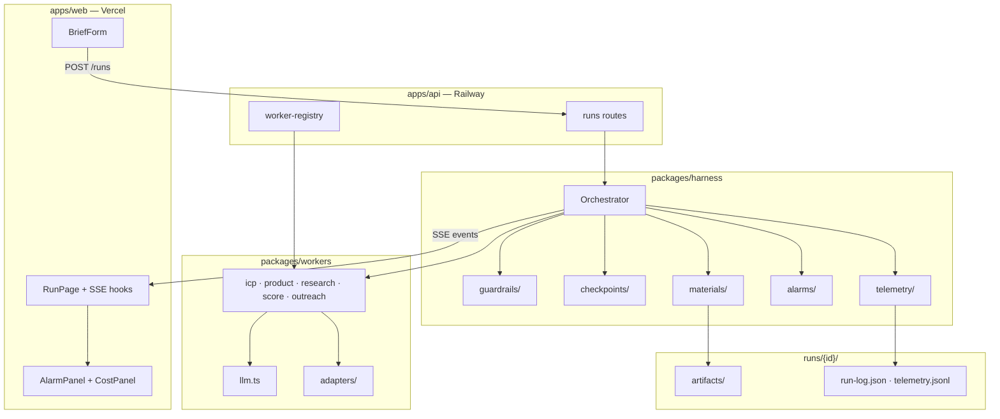
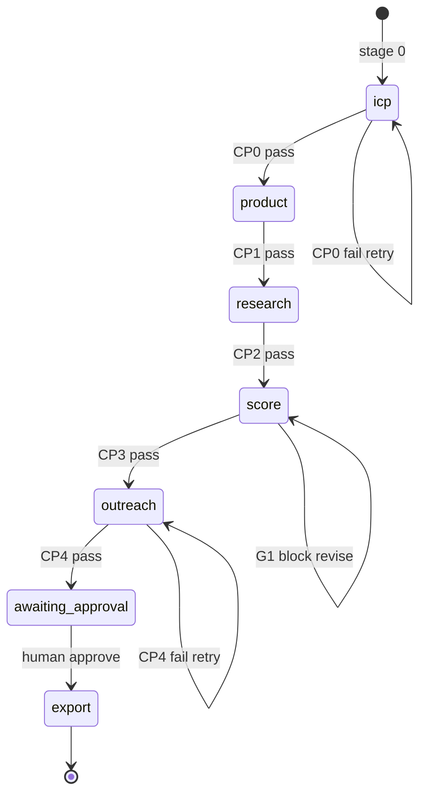

# feat: Scout harness implementation (PR-sized units)

## Summary

Implement Scout end-to-end per `docs/HARNESS_PLANNING.md`: harness orchestrator with guardrails/checkpoints/observability, swappable workers, Next.js demo UI, and Hono API. Work ships as **10 discrete PRs** on the critical path U1→U2→U3→U4→U7, with a **parallel setup runbook** so you can obtain API keys and cloud accounts while the agent implements earlier units.

**Current state:** Monorepo scaffold exists (`apps/web`, `apps/api`, `packages/*`). Partial U1 schemas, stub orchestrator, no tests, no live pipeline.

---

## Problem Frame

Scout is evaluated on **harness design** (loop, tools, guardrails, observability), not domain novelty. The repo has planning docs and a runnable API shell, but no stage machine, no disk persistence, no seed pipeline, and no demo UI beyond a placeholder page. Implementation must preserve the harness/worker separation and produce judge-visible demo moments (G1 budget loop, CP4 retry, ICP evidence, token/cost panel).

---

## Requirements

Requirements trace to `docs/HARNESS_PLANNING.md` (R1–R22). Grouped by concern:

### Harness architecture

- R1. Guardrails as separate modules in `packages/harness/guardrails/`.
- R2. Minimum guardrails: budget, platform allow/block, risk tier, no-send.
- R3. Guardrail blocks emit structured feedback; workers revise or run escalates.
- R4. Checkpoints as separate modules in `packages/harness/checkpoints/`.
- R5. CP0–CP4 with explicit pass/fail criteria per planning doc.
- R6. Failed checkpoints block downstream; retry or escalate — never silent continue.
- R7. Typed artifacts via `packages/harness/materials/`.
- R8. Immutable versioned artifact writes.
- R9. Alarms as separate modules in `packages/harness/alarms/`.
- R10. Alarms emit `{ type, context, severity, recommended_action, timestamp }`.
- R11. Workers change behavior from guardrail/checkpoint feedback (G1, CP4).
- R14. Swappable workers via registry — harness unchanged on swap.
- R15. Checkpoint replay from disk without re-running prior stages.
- R16. Human escalation for high-severity alarms and export gate.

### Workers & domain

- R17. ICPWorker: ≥3 evidence source types, ≥2 non-client; automated CP0 retry ladder; no human gate at CP0.
- R18. ProductWorker enriches positioning and tone.
- R19. ResearchWorker discovers creators via adapters (Influencers.club + seed).
- R20. ScoreWorker ranks with client-specific rubric and rationales.
- R21. OutreachWorker drafts only — no send.
- R22. IG read-only when credentials provided (G7).

### Observability & demo

- R13. `HARNESS.md` documents architecture for judges.
- All LLM calls through `packages/workers/llm.ts` with token/cost metering.
- Every stage/checkpoint/guardrail/alarm visible in `run-log.json` AND SSE.
- CostPanel shows per-stage token/cost in UI.

### Docs & delivery

- R12. Accept real client brief input via UI.
- Deployed Vercel UI + Railway API URLs documented.

---

## Parallel setup runbook

**Do these in parallel while the agent works earlier PRs.** Each row lists what to set up, when you need it, and how to verify.

| When (during PR) | Action | Why | Verify |
|------------------|--------|-----|--------|
| **Now (PR1)** | `git push -u origin main` to [github.com/qianhe203/Scout](https://github.com/qianhe203/Scout) if not pushed | Remote PRs need upstream | `git remote -v` shows origin |
| **Now (PR1)** | Copy `.env.example` → `apps/api/.env` and `apps/web/.env.local` | Local dev wiring | API starts on :3001 |
| **PR1–PR3** | Install pnpm globally or use `npx pnpm@9.15.0` | Workspace scripts | `pnpm install` succeeds |
| **Before PR6** | **Anthropic** or **OpenAI** API key | LLM workers + CP4 (PR8+) | One test completion call |
| **Before PR6** | **Tavily** ([tavily.com](https://tavily.com)) or **Serper** trial key | ICP web search (PR7) | One search returns results |
| **Before PR8** | **Influencers.club** trial ([docs.influencers.club](https://docs.influencers.club/)) — 10 free credits | Live creator discovery | One discovery call returns profiles |
| **Before PR8** | Pick **demo company/product** + website URL | Real brief for testing & hackathon | Brief JSON ready to paste |
| **Before PR10** | **Vercel** account — import Scout repo, root `apps/web` | UI deploy | Preview URL loads |
| **Before PR10** | **Railway** account — deploy `apps/api`, volume at `/data/runs` | Persistent `runs/` + SSE | `GET /health` returns ok |
| **Optional PR10** | **Jaeger** or **Honeycomb** free tier OTLP endpoint | OTel trace viewer | Trace appears after one run |
| **PR3** | Expand `data/creators.json` to 20–30 creators, ≥3 platforms | Reliable CP2 on seed path | Manual count in file |

### Environment template (Railway `apps/api`)

```bash
LLM_PROVIDER=anthropic          # or openai
ANTHROPIC_API_KEY=sk-...
TAVILY_API_KEY=tvly-...         # or SERPER_API_KEY
INFLUENCERS_CLUB_API_KEY=...
RUNS_DIR=/data/runs
CORS_ORIGIN=https://your-app.vercel.app
RUN_TOKEN_BUDGET=50000
RUN_COST_CAP=2.00
OTEL_EXPORTER_OTLP_ENDPOINT=    # optional
```

### Environment template (Vercel `apps/web`)

```bash
NEXT_PUBLIC_HARNESS_API_URL=https://your-api.railway.app
```

---

## PR strategy

One implementation unit ≈ one PR. Merge in order; each PR should be reviewable standalone.

| PR | Unit | Title | Merge depends on |
|----|------|-------|------------------|
| 1 | U1 | Shared schemas + vitest bootstrap | — |
| 2 | U2 | Harness orchestrator + materials + persistence | U1 |
| 3 | U3 | Guardrails, checkpoints, alarms, telemetry writers | U2 |
| 4 | U4 | `llm.ts` + OTel instrumentation bootstrap | U1 |
| 5 | U5 | Seed workers + seed adapter (no LLM) | U2, U3 |
| 6 | U6 | API async runs + SSE pub/sub + disk writes | U2, U3, U5 |
| 7 | U7 | Next.js BriefForm + run page + SSE panels | U6 |
| 8 | U8 | ICP adapters + ICPWorker | U4, U6 |
| 9 | U9 | Influencers.club + remaining LLM workers + CP4 | U4, U6, U8 |
| 10 | U10 | Demo loops (G1, CP4) + approval + CampaignPack + deploy | U7, U9 |

**Demo milestone:** After PR6 merges, seed-only pipeline runs end-to-end via API (no UI polish). After PR7, UI shows live events. After PR10, hackathon demo path is complete.

---

## Key Technical Decisions

- **KTD1 — PR-sized units over big-bang:** Each PR lands one vertical slice reviewable in <30 min. Critical path preserved; U4 (`llm.ts`) parallelizes with U2/U3 because seed path (U5) needs no LLM.
- **KTD2 — Vitest at root:** No test infra exists. Add `vitest` in PR1; unit-test schemas, guardrails, checkpoints, and pure workers. API integration tests use `hono` test client in PR6.
- **KTD3 — Disk persistence before LLM:** Orchestrator writes `runs/{id}/` before any paid API calls. Enables replay (R15) and observability defense.
- **KTD4 — In-memory SSE pub/sub per runId:** Sufficient for single Railway instance demo. Document multi-instance limitation in `HARNESS.md`.
- **KTD5 — CP0 automated retry only:** No human gate at ICP per planning doc. Thin evidence → `ICP_EVIDENCE_THIN` → product page + expanded search → continue with `ICP_LOW_CONFIDENCE` if still thin.
- **KTD6 — Seed-first integration:** U5 proves full harness loop before Influencers.club credits are spent (PR8+).
- **KTD7 — All LLM via `llm.ts`:** Single metering point for tokens, cost, OTel spans, and spin detection.

---

## High-Level Technical Design

### Component topology



### Stage machine (orchestrator)



---

## Output Structure

Expected directories after all units land (new files bolded):

```
Scout/
├── apps/
│   ├── api/src/
│   │   ├── instrumentation.ts
│   │   ├── index.ts
│   │   ├── routes/runs.ts
│   │   ├── worker-registry.ts
│   │   └── **sse/pubsub.ts**
│   └── web/
│       ├── app/
│       │   ├── page.tsx
│       │   └── **runs/[id]/page.tsx**
│       ├── components/** (BriefForm, PipelineTimeline, etc.)
│       └── hooks/**useRunEvents.ts**
├── packages/
│   ├── shared/src/schemas/**
│   ├── harness/
│   │   ├── orchestrator.ts
│   │   ├── **guardrails/**
│   │   ├── **checkpoints/**
│   │   ├── **materials/**
│   │   ├── **alarms/**
│   │   └── **telemetry/**
│   └── workers/
│       ├── **llm.ts**
│       ├── **icp.ts · product.ts · research.ts · score.ts · outreach.ts**
│       └── adapters/**
├── data/creators.json
├── **vitest.config.ts**
└── docs/plans/2026-06-13-001-feat-scout-harness-implementation-plan.md
```

---

## Scope Boundaries

### In scope

- Full pipeline stages 0–5 per planning doc.
- G1–G7 guardrails, CP0–CP4 checkpoints.
- Five-layer observability (disk, SSE, UI, telemetry, OTel console minimum).
- Seed path + live Influencers.club path.
- Vercel + Railway deploy configs.

### Deferred to follow-up work

- Multi-instance SSE (Redis pub/sub).
- OTLP export to paid observability backends (beyond console + optional Jaeger).
- IG OAuth live integration.
- CI GitHub Actions workflow.
- Paid ICP APIs (Clearbit, Selda, OpenFunnel).

### Non-goals

- Auto-send outreach, payments, production scandal ML, Postgres/Redis.

---

## Implementation Units

### U1. Shared schemas + test bootstrap

**Goal:** Complete Zod contracts and vitest so downstream units validate artifacts at write time.

**Requirements:** R7, R8, R10 (Alarm shape), R17 (ICPProposal evidence fields).

**Dependencies:** None.

**Files:**
- `packages/shared/src/schemas/client-brief.ts` (extend expanded fields)
- `packages/shared/src/schemas/icp-proposal.ts`
- `packages/shared/src/schemas/product-brief.ts`
- `packages/shared/src/schemas/creator-candidate.ts`
- `packages/shared/src/schemas/ranked-shortlist.ts`
- `packages/shared/src/schemas/outreach-drafts.ts`
- `packages/shared/src/schemas/campaign-pack.ts`
- `packages/shared/src/schemas/harness-run-log.ts`
- `packages/shared/src/schemas/feedback.ts`
- `packages/shared/src/events.ts` (verify union matches planning doc)
- `packages/shared/src/index.ts`
- `vitest.config.ts`
- `packages/shared/src/schemas/__tests__/artifacts.test.ts`

**Approach:** One schema file per artifact. Export inferred TypeScript types. Add parse tests for valid/invalid fixtures copied from planning doc examples.

**Patterns to follow:** Existing `ClientBriefSchema` in `packages/shared/src/schemas/client-brief.ts`.

**Test scenarios:**
- ClientBrief accepts expanded optional fields (`exampleCustomers`, `admiredCompetitor`).
- ICPProposal rejects segments with only `client_brief` evidence when `evidenceSourceTypes.length < 3`.
- RankedShortlist requires `rationale` and `fitScore` per creator.
- RunEvent union parses each `kind` discriminator.

**Verification:** `pnpm --filter @scout/shared test` passes; `typecheck` clean.

**PR title:** `feat(shared): complete artifact schemas and vitest bootstrap`

---

### U2. Orchestrator + materials + persistence

**Goal:** Stage machine skeleton that reads/writes `runs/{id}/` and advances stages 0→5 without real workers.

**Requirements:** R6, R7, R8, R15.

**Dependencies:** U1.

**Files:**
- `packages/harness/src/orchestrator.ts`
- `packages/harness/src/materials/store.ts`
- `packages/harness/src/materials/validate.ts`
- `packages/harness/src/persistence/run-store.ts`
- `packages/harness/src/types.ts`
- `packages/harness/src/index.ts`
- `packages/harness/src/__tests__/orchestrator.test.ts`
- `packages/harness/src/__tests__/materials.test.ts`

**Approach:** `runStage()` loop per planning pseudocode. Materials validate with Zod, assign version, write `artifacts/{type}_v{n}.json`. `meta.json` tracks status/stage. Inject worker registry; use mock workers that return fixture artifacts.

**Test scenarios:**
- Stage completes → artifact file exists with incremented version.
- Revision creates `RankedShortlist_v2` without deleting v1.
- `loadRun(runId, fromCheckpoint)` reconstructs context with artifacts through CPn.

**Verification:** Orchestrator advances through all stages with mock workers; files appear under `runs/{testId}/`.

**PR title:** `feat(harness): orchestrator stage machine and artifact persistence`

---

### U3. Guardrails, checkpoints, alarms, telemetry writers

**Goal:** Enforce G1–G7 and CP0–CP4 as separate modules; emit alarms; append telemetry/run-log.

**Requirements:** R1–R6, R9–R11, observability layers 1–2.

**Dependencies:** U2.

**Files:**
- `packages/harness/src/guardrails/g1-budget.ts` … `g7-ig-readonly.ts`
- `packages/harness/src/guardrails/index.ts`
- `packages/harness/src/checkpoints/cp0-icp.ts` … `cp4-professionalism.ts`
- `packages/harness/src/checkpoints/index.ts`
- `packages/harness/src/alarms/emit.ts`
- `packages/harness/src/telemetry/writer.ts`
- `packages/harness/src/telemetry/watchdog.ts`
- `packages/harness/src/__tests__/g1-budget.test.ts`
- `packages/harness/src/__tests__/cp0-icp.test.ts`

**Approach:** Guardrails are pure functions. CP0 checks ≥3 evidence source types and ≥2 non-client. CP4 stub returns fixed pass until U9 wires LLM evaluator. Telemetry writer appends `telemetry.jsonl` and updates `run-log.json`. Watchdog emits `LLM_SPIN_DETECTED` on stage timeout.

**Test scenarios:**
- G1 blocks when shortlist total > budget; feedback includes `trimToBudget`.
- CP0 fails when only `client_brief` evidence; passes with 3 source types.
- Alarm appends one JSON line to `alarms.jsonl`.
- Checkpoint writes `checkpoints/CP0.json`.

**Verification:** Unit tests pass; orchestrator integration test shows G1 block → retry path wired (mock ScoreWorker receives feedback).

**PR title:** `feat(harness): guardrails, checkpoints, alarms, and telemetry`

---

### U4. LLM wrapper + OpenTelemetry bootstrap

**Goal:** Single LLM entry point with token metering; OTel init before API imports.

**Requirements:** Observability KTD7; GenAI semantic conventions.

**Dependencies:** U1.

**Files:**
- `packages/workers/src/llm.ts`
- `packages/workers/src/llm-provider.ts`
- `apps/api/src/instrumentation.ts`
- `apps/api/package.json` (add OTel deps)
- `packages/workers/src/__tests__/llm.test.ts`

**Approach:** `callLLM()` records usage via `estimateCostUsd`, writes telemetry event callback, sets OTel span attributes. Provider switch on `LLM_PROVIDER` env. Instrumentation loads ConsoleSpanExporter locally; OTLP when endpoint set.

**Test scenarios:**
- Mock provider returns usage → `estimatedCostUsd` computed from `model-pricing.ts`.
- Token budget exceeded → throws or returns signal for harness watchdog.
- Span attributes include `gen_ai.usage.input_tokens`.

**Verification:** Unit test with mocked fetch/SDK; manual run logs span to console.

**PR title:** `feat(workers): unified LLM wrapper with token metering and OTel`

---

### U5. Seed workers (no LLM pipeline)

**Goal:** End-to-end pipeline without paid APIs — seed research + rule-based scoring.

**Requirements:** R14, R19 (seed path), R20 (rule-based).

**Dependencies:** U2, U3.

**Files:**
- `packages/workers/src/adapters/seed.ts`
- `packages/workers/src/research/seed-research.ts`
- `packages/workers/src/score/rule-based-score.ts`
- `packages/workers/src/index.ts`
- `apps/api/src/worker-registry.ts`
- `packages/workers/src/__tests__/seed-adapter.test.ts`
- `packages/workers/src/__tests__/rule-based-score.test.ts`

**Approach:** Seed adapter filters `data/creators.json` by platform + audience tags from ICP. Rule-based ScoreWorker computes `fitScore` from tag overlap + engagement. Registry `workerMode=seed-only` swaps research worker.

**Test scenarios:**
- Seed adapter returns ≥5 candidates when ICP tags match seed data.
- ScoreWorker produces ranked list with monotonic fitScore ordering.
- `workerMode=seed-only` registry returns SeedResearchWorker.

**Verification:** API `POST /runs` with seed workers completes pipeline; `CreatorCandidates` and `RankedShortlist` artifacts on disk.

**PR title:** `feat(workers): seed research and rule-based scoring path`

---

### U6. API async orchestration + SSE

**Goal:** Non-blocking runs, live SSE stream, disk-backed events for UI.

**Requirements:** R15 (replay endpoint stub), observability layer 2.

**Dependencies:** U2, U3, U5.

**Files:**
- `apps/api/src/routes/runs.ts`
- `apps/api/src/sse/pubsub.ts`
- `apps/api/src/routes/runs.test.ts`
- `apps/api/src/index.ts`

**Approach:** `POST /runs` returns `{ runId }` immediately; orchestrator runs in background. Pub/sub emits `RunEvent` to SSE subscribers. Add `GET /runs/:id/telemetry`, `POST /runs/:id/replay?from=CPn` (load artifacts, resume). CORS from `CORS_ORIGIN`.

**Test scenarios:**
- POST /runs returns 201 with runId before pipeline completes.
- SSE client receives `stage_started` then `artifact_written` events in order.
- GET /runs/:id returns status and summary after completion.
- Replay from CP2 skips stages 0–2 (mock assertion on worker call count).

**Verification:** Integration test with hono test client + EventSource polyfill or chunked read.

**PR title:** `feat(api): async pipeline runs and SSE event stream`

---

### U7. Next.js demo UI

**Goal:** Submit brief, watch pipeline, see alarms and costs, approve export.

**Requirements:** R12, observability layer 3.

**Dependencies:** U6.

**Files:**
- `apps/web/components/BriefForm.tsx`
- `apps/web/components/PipelineTimeline.tsx`
- `apps/web/components/ArtifactViewer.tsx`
- `apps/web/components/AlarmPanel.tsx`
- `apps/web/components/CostPanel.tsx`
- `apps/web/components/ApprovalGate.tsx`
- `apps/web/components/FeedbackBanner.tsx`
- `apps/web/hooks/useRunEvents.ts`
- `apps/web/app/runs/[id]/page.tsx`
- `apps/web/app/page.tsx`
- `apps/web/lib/api.ts`

**Approach:** BriefForm posts to API, navigates to `/runs/[id]`, opens EventSource. Panels subscribe to event kinds. Dark theme per planning doc. Expanded brief fields optional on form.

**Test scenarios:**
- Test expectation: none — UI components; manual verification via browser.
- Manual: submit brief → timeline shows stage badges updating live.
- Manual: AlarmPanel renders raw JSON from `alarm` events.
- Manual: CostPanel accumulates `llm_call` token totals.

**Verification:** Local `pnpm dev` — full UX path with seed workers.

**PR title:** `feat(web): brief form, run page, and observability panels`

---

### U8. ICP adapters + ICPWorker

**Goal:** Multi-source ICP research with evidence citations and CP0 retry ladder.

**Requirements:** R17, CP0 rules.

**Dependencies:** U4, U6.

**Files:**
- `packages/workers/src/adapters/web-search.ts`
- `packages/workers/src/adapters/website.ts`
- `packages/workers/src/adapters/creator-graph.ts`
- `packages/workers/src/icp.ts`
- `packages/workers/src/__tests__/icp.test.ts`
- `packages/workers/src/__tests__/web-search.adapter.test.ts`

**Approach:** Parallel adapter calls in ICPWorker. Synthesis prompt produces `ICPProposal` with `evidenceSourceTypes`. Pass 2 retry fetches product page when `ICP_EVIDENCE_THIN`. Creator graph uses seed filter or thin Influencers.club semantic call if key present.

**Test scenarios:**
- Mock web search returns snippets → ICPProposal has `web_search_category` evidence.
- With only client_brief evidence → CP0 fails first pass.
- Retry pass adds `product_page` evidence when `productUrl` set.
- `clientAlignment` populated when `targetAudience` contradicts research.

**Verification:** Run with Tavily key produces `ICPProposal_v1.json` with ≥3 source types.

**PR title:** `feat(workers): ICP multi-source research and adapters`

---

### U9. Live workers + Influencers.club + CP4 evaluator

**Goal:** Full LLM worker set and live creator discovery.

**Requirements:** R18–R21, R4–R5 (CP4 separate from OutreachWorker).

**Dependencies:** U4, U6, U8.

**Files:**
- `packages/workers/src/adapters/influencers-club.ts`
- `packages/workers/src/product.ts`
- `packages/workers/src/research.ts`
- `packages/workers/src/score.ts`
- `packages/workers/src/outreach.ts`
- `packages/harness/src/checkpoints/cp4-professionalism.ts` (LLM evaluator)
- `packages/workers/src/__tests__/influencers-club.adapter.test.ts`

**Approach:** ResearchWorker translates ICP+ProductBrief to API query. Influencers.club failure → seed fallback + `RESEARCH_SOURCE_DOWN`. CP4 module calls `llm.ts` with fixed rubric — not inside OutreachWorker.

**Test scenarios:**
- Influencers.club adapter normalizes API response to `CreatorCandidate[]`.
- API failure triggers seed fallback and alarm type `RESEARCH_SOURCE_DOWN`.
- CP4 scores <80 → feedback payload with `failures[]` list.
- OutreachWorker receives CP4 critique and produces revised drafts.

**Verification:** Live run with API keys produces `CreatorCandidates` from Influencers.club; CP4 pass/fail visible in checkpoints.

**PR title:** `feat(workers): LLM workers, Influencers.club adapter, and CP4 evaluator`

---

### U10. Demo loops, export, deploy

**Goal:** Hackathon-ready demo — G1 revision visible, CP4 retry, human approval, CampaignPack, deploy URLs.

**Requirements:** R11, R13, R16, R12, deploy checklist.

**Dependencies:** U7, U9.

**Files:**
- `packages/harness/src/orchestrator.ts` (retry wiring polish)
- `packages/workers/src/score.ts` (G1 knapsack revision)
- `apps/api/src/routes/runs.ts` (`POST /approve`, export assembly)
- `data/creators.json` (expand to 20–30)
- `HARNESS.md`
- `README.md` (deploy URLs)
- `apps/web/components/ArtifactViewer.tsx` (version diff v1→v2)
- `railway.json` or Railway README section
- `apps/web/vercel.json` if needed

**Approach:** ScoreWorker re-optimizes under budget on G1 feedback without re-calling API. Approve assembles CSV + summary.md. Expand seed data. Document Vercel + Railway setup in README.

**Test scenarios:**
- G1 block → `RankedShortlist_v2` total ≤ budget; `BUDGET_EXCEEDED` alarm emitted.
- CP4 fail → retry → pass within max retries.
- Approve writes `export/campaign-pack.csv` and `summary.md`.
- `pnpm build` succeeds for web and api.

**Verification:** Manual 5-min demo script from `docs/HACKATHON.md` completes without errors.

**PR title:** `feat: demo loops, campaign export, and deploy config`

---

## System-Wide Impact

- **Auth/secrets:** API keys only on Railway API — never in Next.js client bundle.
- **Persistence:** All run state on Railway volume; UI is stateless.
- **Cost control:** `RUN_TOKEN_BUDGET` and `RUN_COST_CAP` env vars gate LLM spend.
- **CORS:** SSE requires explicit `CORS_ORIGIN` matching Vercel URL.

---

## Risks & Dependencies

| Risk | Mitigation |
|------|------------|
| Influencers.club credits exhausted during dev | Seed path (U5) for daily dev; reserve live API for PR9+ verification |
| Tavily rate limits | Cache search results in run artifacts for replay |
| SSE drops on Railway sleep | Document "wake API before demo"; health ping |
| CP4 LLM latency blows demo timing | Pre-bake one run on disk for backup replay |
| GitHub push/auth not configured | Setup runbook row 1 — blocks PR workflow |

---

## Open Questions

| Question | Blocks | Default if unresolved |
|----------|--------|----------------------|
| Demo company/product for hackathon | U8+ live testing | Use operator's own product |
| Anthropic vs OpenAI | U4 provider | Anthropic if key available |
| Tavily vs Serper | U8 web search | Tavily (planning doc default) |
| OTel: console only vs Jaeger | U10 defense | Console + `telemetry.jsonl` minimum |

---

## Plan validation checklist

Use this to confirm the plan matches repo reality before opening PR1:

- [ ] `docs/HARNESS_PLANNING.md` is the build spec; `docs/HACKATHON.md` is demo/defense only.
- [ ] Monorepo scaffold matches `docs/HARNESS_PLANNING.md` repo structure section.
- [ ] Critical path U1→U2→U3→U4(parallel)→U5→U6→U7→U8→U9→U10 preserved.
- [ ] Each PR has test scenarios or explicit `Test expectation: none` with reason.
- [ ] Setup runbook covers all keys needed before PR6/PR8/PR10.
- [ ] No product behavior invented beyond planning doc (CP0 no human gate, ≥3 evidence types).

---

## Sources & Research

- **Build spec:** `docs/HARNESS_PLANNING.md` — schemas, stages, guardrails, observability, deployment.
- **Demo/defense:** `docs/HACKATHON.md` — 5-min script, judging criteria.
- **Existing code:** `packages/shared/src/schemas/client-brief.ts`, `apps/api/src/routes/runs.ts`, `packages/harness/src/orchestrator.ts` (stub).
- **Repo state (2026-06-13):** Partial U1, stub orchestrator, no tests, no live pipeline.
- **External (load-bearing):** [Influencers.club API](https://docs.influencers.club/), [Fired Festival harness pillars](https://fired-festival.com/harness), OTel GenAI conventions.
