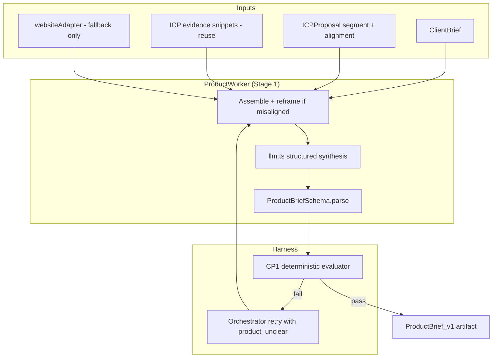

# feat: ProductWorker — positioning synthesis and CP1

## Summary

Implement **ProductWorker** (Stage 1): the **translation layer** from messy `ClientBrief` to machine-consumable **`ProductBrief`**. Value is consistency and constraint for downstream workers — not novel discovery. Synthesis uses client input + ICP primary segment + **reused ICP evidence snippets** (page/competitor), with optional `websiteAdapter` only when page evidence is missing. When `clientAlignment` is off, messaging reframes for the researched segment. **CP1** validates deterministically (including segment–message fit) and retries on `product_unclear` feedback.

**Current state:** `ProductBriefSchema` exists; `ProductWorker` is a stub in `packages/workers/src/index.ts`. No `product.ts`, no CP1 module, no `product_unclear` feedback kind.

---

## Problem Frame

Scout's pipeline separates *who to reach* (ICPWorker, Stage 0) from *what to sell and how to talk about it* (ProductWorker, Stage 1). Downstream workers — ResearchWorker (API query translation), ScoreWorker (fit rationales), OutreachWorker (draft tone) — all consume `ProductBrief`. Without ProductWorker, Stage 1 cannot run and CP1 cannot gate research spend.

The parent plan (`2026-06-13-001`) bundles ProductWorker into U9 with four other workers. This plan zooms in on ProductWorker's **build approach** and clarifies what "research" means for this worker — a common source of confusion with ICPWorker's multi-source market research.

---

## Requirements

| ID | Requirement | ProductWorker responsibility |
|----|-------------|---------------------------|
| R18 | ProductWorker enriches positioning, value props, and tone guidance | Core synthesis output |
| R5 / CP1 | Checkpoint pass/fail after Stage 1 | Harness CP1 module validates `ProductBrief` |
| R6 | Failed checkpoint blocks downstream; retry or escalate | Orchestrator retries ProductWorker with feedback |
| R7–R8 | Typed, immutable artifact | Returns `ProductBrief` for materials layer |
| R11 | Worker revises on checkpoint feedback | Second-pass prompt includes `product_unclear` critique |

**Explicit non-requirements for ProductWorker:**

- No Tavily/Serper web search (ICPWorker only)
- No creator-graph or competitor inference
- No audience segment discovery (reads `ICPProposal` for alignment only)
- No guardrail or checkpoint enforcement inside the worker

---

## Key Technical Decisions

### KTD1: Translation layer, not discovery

**Chosen:** Single-pass synthesis that produces a stable `ProductBrief` contract for ResearchWorker, ScoreWorker, and OutreachWorker.

**Rejected:** New web search, new evidence types, or audience segment invention.

**Rationale:** ICPWorker owns independent audience research (CP0). ProductWorker owns *what/how to say* for the segment ICP already chose. Uniqueness is **ICP-informed reframing + reused evidence + risk-calibrated voice**, not paraphrasing `ClientBrief` alone.

### KTD2: Input assembly order

**Chosen:**

1. `ctx.clientBrief` — always (company, product, `whyTheyBuy`, `exampleCustomers`, `admiredCompetitor`, risk tier)
2. `ctx.artifacts.ICPProposal` — primary segment (`persona`, `channels`, `rationale`), `clientAlignment`, `alignmentNotes`
3. **ICP evidence snippets** — extract from primary segment `evidence[]` where `source` is `website`, `product_page`, or `web_search_competitor` (cap ~5 snippets, truncate for token budget). No new tool calls.
4. **ICP reframe rule** — if `clientAlignment` is `contradicted` or `partial`, prompt instructs: target researched segment, ignore `clientStatedAudience` for messaging
5. Optional `websiteAdapter.fetch()` — **only if** step 3 has no `website`/`product_page` snippets and `productUrl` or `companyWebsiteUrl` is set; on failure, continue without fetch

**Rejected:** Mandatory website fetch; channel-specific schema fields; second Tavily pass for competitors.

**Rationale:** Reusing ICP evidence avoids duplicate fetches and grounds differentiators in researched page/competitor text. Website fetch is a fallback, not the default path.

### KTD3: One LLM call per attempt via `llm.ts`

**Chosen:** Structured JSON output validated against `ProductBriefSchema`. Internal parse retry once on malformed JSON before throwing to harness.

**Rejected:** Multi-step agentic loop inside ProductWorker.

**Rationale:** Consistent with other workers (~5–8 LLM calls per full run budget). CP1 handles quality gate; orchestrator handles external retry.

### KTD4: CP1 is deterministic Zod + light quality heuristics

**Chosen:** `packages/harness/checkpoints/cp1-product.ts` validates:

- `ProductBriefSchema.safeParse()` passes
- `differentiators.length >= 2`
- `keyMessages.length >= 2`
- `valueProposition` and `toneGuidance` each ≥ 20 characters (reject one-word stubs)
- `toneGuidance` safe for `risk=low` (reject obvious edgy/buzz keywords)
- **Segment fit:** at least one `keyMessage` shares ≥1 significant token (length ≥4, stopwords stripped) with primary segment `persona` + `rationale` combined text

**Rejected:** LLM evaluator at CP1 (reserved for CP4 professionalism); structured per-channel message schema.

**Rationale:** Segment-fit check is a cheap deterministic guard that messaging is audience-specific, not generic product copy. Keeps `keyMessages` as `string[]` — prompt may ask for channel-aware phrasing inside strings, no schema change.

### KTD5: CP1 failure feedback shape

**Chosen:** Add `product_unclear` to `CheckpointFeedbackSchema`:

```typescript
{ kind: "product_unclear"; missingFields: string[]; vagueFields: string[]; hint: string }
```

ProductWorker's retry prompt appends this critique. Alarm type `PRODUCT_UNCLEAR` (medium severity) emitted on CP1 fail.

**Rejected:** Generic `checkpoint_fail` only — too vague for useful LLM revision.

### KTD6: Shared `websiteAdapter`, product-focused prompt

**Chosen:** Reuse `packages/workers/src/adapters/website.ts` from parent plan U8. ProductWorker passes URLs and consumes `{ title, aboutText, productText, pricingCues }` with a **product-positioning extraction prompt**, not ICP audience prompts.

**Dependency:** U8 must land `websiteAdapter` first, or this plan's U2 includes a minimal website adapter stub sufficient for ProductWorker tests.

---

## High-Level Technical Design



**Stage sequence:**

```
CP0 pass → ProductWorker.run() → materials.store(ProductBrief) → CP1.evaluate() → advance to ResearchWorker
```

---

## Scope Boundaries

### In scope

- `ProductWorker` class and synthesis prompt
- `product_unclear` feedback schema + `PRODUCT_UNCLEAR` alarm registration
- CP1 checkpoint module
- Unit tests for worker, CP1, and schema
- Registry wiring (`createWorkers()` returns real `ProductWorker`)

### Out of scope

- ICPWorker, web-search adapters, CP0 retry ladder
- ResearchWorker / Influencers.club (consumes `ProductBrief` downstream)
- CP4 professionalism evaluator
- UI changes beyond displaying `ProductBrief` artifact if ArtifactViewer already generic

### Deferred to Follow-Up Work

- Structured per-channel `keyMessages` schema (prompt-only channel hints for MVP)
- Risk-specific `avoidPhrases` auto-population from scandal keyword lists (nice-to-have for `risk=low`)

---

## Implementation Units

### U1. Shared contracts for ProductBrief and CP1 feedback

**Goal:** Types and tests that CP1 and ProductWorker share.

**Requirements:** R5, R7.

**Dependencies:** None (builds on existing `ProductBriefSchema`).

**Files:**
- `packages/shared/src/schemas/feedback.ts`
- `packages/shared/src/schemas/__tests__/artifacts.test.ts`
- `packages/shared/src/index.ts` (exports if needed)

**Approach:** Add `ProductUnclearFeedbackSchema` with `kind: "product_unclear"`. Extend `CheckpointFeedbackSchema` discriminated union. Add `ProductBriefSchema` valid/invalid fixtures to artifacts test (empty differentiators, valid full brief).

**Test scenarios:**
- Valid `ProductBrief` parses with all required fields.
- Empty `differentiators` array fails `ProductBriefSchema`.
- `product_unclear` feedback parses with `missingFields` and `vagueFields` arrays.
- `HarnessFeedbackSchema` accepts `product_unclear` as checkpoint feedback.

**Verification:** `pnpm test` passes for shared package.

---

### U2. ProductWorker core

**Goal:** Stage 1 worker that produces `ProductBrief` from client input, ICP context, and optional website content.

**Requirements:** R18.

**Dependencies:** U1, parent plan U4 (`llm.ts`), parent plan U8 (`websiteAdapter`) or minimal adapter stub.

**Files:**
- `packages/workers/src/product.ts`
- `packages/workers/src/prompts/product-synthesis.ts`
- `packages/workers/src/__tests__/product.test.ts`
- `packages/workers/src/index.ts` (export `ProductWorker`, wire in future registry)

**Approach:**

1. **Context assembly** — Build synthesis payload:
   - From `ClientBrief`: company, product, description, `whyTheyBuy`, `exampleCustomers`, `admiredCompetitor`, `risk`
   - From `ICPProposal`: primary segment persona, channels, rationale; `clientAlignment` + `alignmentNotes`
   - From ICP `evidence[]`: snippets tagged `website`, `product_page`, `web_search_competitor` (helper `extractProductEvidence(icp)` — max 5 snippets)
   - From `ctx.feedback` when `kind === "product_unclear"`: append revision instructions

2. **Reframe rule in prompt** — When `clientAlignment` is `contradicted` or `partial`, explicit instruction: write value prop and key messages for the researched segment, not `clientStatedAudience`. When `confirmed`, align messaging to segment anyway.

3. **Website fallback only** — Call `websiteAdapter.fetch()` only when step 1 found no `website`/`product_page` snippets and a URL exists. Prefer `productUrl`, else `companyWebsiteUrl`. Log `tool_call` telemetry; continue on failure.

4. **LLM synthesis** — `callLLM()` with product-marketing system prompt; user prompt = payload + evidence snippets + optional fetch text. Prompt asks for ≥1 competitor contrast differentiator when competitor snippets present. Output JSON → `ProductBriefSchema.parse()`.

5. **Risk-aware tone** — `risk=low`: professional, scandal-averse, suggest `avoidPhrases`; `risk=high`: edgier hooks OK, no false claims. Prompt notes primary segment `channels` so key messages can be channel-aware in plain strings.

**Patterns to follow:** Mirror ICPWorker's adapter-then-synthesize shape from parent plan U8 (parallel fetch optional, single synthesis call, schema validation before return). Use `llm.ts` exclusively — no direct provider calls.

**Test scenarios:**
- **Happy path:** Mock `llm.ts` returns valid JSON → worker returns `ProductBrief` with ≥2 differentiators and tone matching `risk=low`.
- **ICP reframe:** `clientAlignment: "contradicted"` with client "Gen Z fitness" vs segment "home-workout beginners" → prompt includes reframe instruction; mock output targets beginners.
- **Evidence reuse:** ICP evidence includes `product_page` snippet → synthesis prompt contains snippet; no `websiteAdapter` call when snippets present.
- **Segment fit (CP1):** Generic keyMessages with no persona overlap → CP1 fails segment-fit heuristic.
- **Website fetch:** Mock adapter returns `productText` → `valueProposition` incorporates product page content (assert prompt or output contains distinctive phrase from mock).
- **Website skip:** No URLs in brief → worker succeeds using client fields only; no adapter call.
- **Adapter failure:** Mock adapter throws → worker still returns valid `ProductBrief`; telemetry records failed tool call.
- **Retry path:** `ctx.feedback` is `product_unclear` with `vagueFields: ["valueProposition"]` → second prompt includes revision hint; mock LLM returns improved prop.
- **Parse failure:** Mock LLM returns invalid JSON once then valid → internal retry succeeds.

**Verification:** `ProductWorker.run()` with fixture `HarnessContext` returns schema-valid `ProductBrief` in isolation tests.

---

### U3. CP1 checkpoint module

**Goal:** Deterministic post-Stage-1 evaluator with structured failure feedback.

**Requirements:** R5, R6, R11.

**Dependencies:** U1, parent plan U2 (orchestrator must call checkpoint after Stage 1).

**Files:**
- `packages/harness/src/checkpoints/cp1-product.ts`
- `packages/harness/src/alarms/registry.ts` (register `PRODUCT_UNCLEAR` if centralized)
- `packages/harness/src/__tests__/cp1-product.test.ts`

**Approach:** Export `evaluateCp1(ctx: HarnessContext): CheckpointResult`. Load latest `ProductBrief` from `ctx.artifacts`. Run schema parse + heuristics from KTD4. On fail, return `{ passed: false, feedback: ProductUnclearFeedback, alarm: { type: "PRODUCT_UNCLEAR", ... } }`. On pass, return `{ passed: true }`.

**Test scenarios:**
- Valid `ProductBrief` with 2+ differentiators and 2+ key messages → pass.
- Schema-valid but `valueProposition` length 5 → fail with `vagueFields` containing `valueProposition`.
- `risk=low` brief where `toneGuidance` contains "edgy viral chaos" → fail with hint to soften tone.
- Key messages with zero token overlap vs segment persona/rationale → fail with `vagueFields: ["keyMessages"]` and hint to target researched audience.
- Missing artifact → fail with `missingFields: ["ProductBrief"]`.

**Verification:** CP1 tests pass; orchestrator integration test (parent U2) advances to Stage 2 only after CP1 pass.

---

### U4. Registry and Stage 1 integration

**Goal:** Replace ProductWorker stub in live worker registry; prove Stage 0→1→2 handoff.

**Requirements:** R14, R18.

**Dependencies:** U2, U3, parent plan U2 (orchestrator), parent plan U6 (API optional for E2E).

**Files:**
- `apps/api/src/worker-registry.ts`
- `packages/harness/src/__tests__/orchestrator-product-stage.test.ts`
- `packages/workers/src/index.ts`

**Approach:** `createWorkers("llm")` instantiates `new ProductWorker(deps)` with injected `llm` and `websiteAdapter`. Orchestrator test: mock ICPWorker returns minimal valid `ICPProposal`; real or mocked ProductWorker returns `ProductBrief`; CP1 passes; stage advances to `research`.

**Test scenarios:**
- Registry returns non-stub `ProductWorker` when mode is `llm`.
- Orchestrator Stage 1 writes `ProductBrief_v1.json` to run artifacts path (if persistence stub supports).
- CP1 fail → orchestrator retries ProductWorker once with feedback → pass on second attempt (mock ProductWorker returns better brief on retry).

**Verification:** Integration test proves pipeline reaches Stage 2 after ProductWorker + CP1.

---

## Dependencies & Sequencing

| Prerequisite (parent plan) | Why ProductWorker needs it |
|----------------------------|---------------------------|
| U1 Shared schemas | `ClientBrief`, `ICPProposal`, artifact types |
| U2 Orchestrator stage machine | Stage 1 invocation, retry, CP1 hook |
| U4 `llm.ts` | All synthesis calls |
| U8 `websiteAdapter` | Optional page grounding (or ship minimal adapter in U2) |

**Recommended PR order:** U1 → U2 → U3 → U4 (single PR or U1+U2 in one PR, U3+U4 in second).

**Relation to parent U9:** This plan **splits ProductWorker out of U9** for clarity. When implementing, either land ProductWorker PR before U9's remaining workers or update parent plan U9 to exclude `product.ts` and reference this plan.

---

## Risks & Mitigations

| Risk | Mitigation |
|------|------------|
| ProductWorker re-derives audience, duplicating ICP | Prompt forbids new segments; only reframe messaging for existing primary segment |
| Segment-fit heuristic too brittle | Use length ≥4 tokens, small stopword list; fail open to retry not hard block on edge cases |
| Thin client brief produces generic `ProductBrief` that passes Zod | CP1 heuristics (min lengths, differentiator count) catch stubs |
| Website fetch duplicates ICP pass-2 fetch | Defer dedup; acceptable for MVP latency |
| `llm.ts` not ready | Block U2 on U4; use mock LLM in tests until U4 lands |
| CP1 and Zod overlap makes heuristics redundant | Heuristics target quality, not structure — keep both |

---

## Open Questions

| Question | Default if unresolved |
|----------|----------------------|
| Minimum `keyMessages` count at CP1 | 2 (per KTD4) |
| Should `avoidPhrases` be required for `risk=low`? | Optional field; prompt suggests population, CP1 does not require |

---

## Sources & Research

- `docs/HARNESS_PLANNING.md` — § ICPWorker vs ProductWorker, § Workers, § Checkpoints CP1, § ProductBrief schema
- `docs/plans/2026-06-13-001-feat-scout-harness-implementation-plan.md` — U8/U9 context
- Repo state: `packages/shared/src/schemas/product-brief.ts`, stub `packages/workers/src/index.ts`
- No external research required — local patterns and planning doc are sufficient
